# Aplikasi Pertama dan Widget Dasar Flutter

## Membuat Project Flutter Baru

### Langkah 1

Buka VS Code, lalu tekan tombol **Ctrl + Shift + P** maka akan tampil Command Palette, lalu ketik Flutter. Pilih **_New Application Project_**.

### Langkah 2

Buat folder sesuai style laporan praktikum yang Anda pilih. Disarankan pada folder dokumen atau desktop atau alamat folder lain yang tidak terlalu dalam atau panjang. Lalu pilih **_Select a folder to create the project in_**.

### Langkah 3

Buat nama project flutter hello_world seperti berikut, lalu tekan Enter. Tunggu hingga proses pembuatan project baru selesai.

### Langkah 4

Jika sudah selesai proses pembuatan project baru, pastikan tampilan seperti berikut. Pesan akan tampil berupa _"Your Flutter Project is ready!"_ artinya Anda telah berhasil membuat project Flutter baru.

## Menghubungkan Perangkat Android atau Emulator

Ada 2 cara untuk menghubungkan perangkat android,

### USB Debugging

Mengaktifkan proses debug USB di setelan Opsi developer di perangkat

1. Di perangkat Android, ketuk Settings > About phone.
2. Ketuk Build number tujuh kali.
3. Jika diminta, masukkan sandi atau PIN perangkat. Anda tahu Anda telah berhasil saat melihat pesan You are now a developer!.
4. Kembali ke Settings, lalu ketuk System > Developer options.
5. Jika Anda tidak melihat Developer options, ketuk Advanced options.
6. Ketuk Developer options, lalu ketuk tombol USB debugging untuk mengaktifkannya.

Jika Android Studio diinstal di Windows, Anda harus menginstal driver perangkat USB agar dapat menjalankan aplikasi di perangkat fisik.

1. Di Android Studio, klik Tools > SDK Manager. Dialog Preferences > Appearance & Behavior > System Settings > Android SDK akan terbuka.
2. Klik tab SDK Tools.
3. Pilih Google USB Driver, lalu klik OK.

Untuk menjalankan aplikasi dari Android Studio di perangkat Android melalui USB Debug

1. Sambungkan perangkat Android ke komputer menggunakan kabel USB. Dialog yang meminta Anda mengizinkan proses debug USB akan muncul di perangkat.
2. Pilih kotak centang Always allow from this computer, lalu ketuk OK.
3. Di Android Studio di komputer, pastikan perangkat Anda dipilih di menu drop-down. Klik Icon Play
4. Pilih perangkat lalu klik OK. Android Studio akan menginstal aplikasi di perangkat, lalu menjalankannya.
5. Jika perangkat menjalankan platform Android yang tidak diinstal di Android Studio dan melihat pesan berisi pertanyaan apakah Anda ingin menginstal platform yang diperlukan, klik Install > Continue > Finish. Android Studio akan menginstal aplikasi di perangkat, lalu menjalankannya.

### Wireless Debug

Jika tidak memiliki kabel, Anda juga dapat menghubungkan dan menjalankan aplikasi di perangkat dengan Wi-Fi.

1. Di Android Studio, pilih Pair Devices Using Wi-Fi dari menu drop-down konfigurasi run.
2. Buka Developer options, scroll ke bawah ke bagian Debugging, lalu aktifkan Wireless debugging.
3. Pada pop-up Izinkan proses debug nirkabel di jaringan ini?, pilih Allow.
4. Jika Anda ingin menyambungkan perangkat dengan kode QR, pilih Pair device with QR code, lalu pindai kode QR di komputer Anda. Atau, jika Anda ingin menyambungkan perangkat dengan kode penghubung, pilih Pair device with pairing code, lalu masukkan 6 digit kode.
5. Klik jalankan dan Anda dapat men-deploy aplikasi ke perangkat.

## Membuat Github Repository

### Langkah 1

Login ke akun [Github](https://github.com) Anda, lalu buat repository baru

### Langkah 2

Lalu klik tombol "Create repository"

### Langkah 3

Kembali ke VS code, project flutter hello_world, buka terminal pada menu Terminal > New Terminal. Lalu ketik perintah berikut untuk inisialisasi git pada project Anda.

```bash
git innit
```

### Langkah 4

Pilih menu Source Control di bagian kiri, lalu lakukan stages (+) pada file .gitignore untuk mengunggah file pertama ke repository GitHub.

### Langkah 5

Beri pesan commit "tambah gitignore" lalu klik Commit (✔)

### Langkah 6

Lakukan push dengan klik bagian menu titik tiga > Push

### Langkah 7

Di pojok kanan bawah akan tampil seperti gambar berikut. Klik "Add Remote"

### Langkah 8

Salin tautan repository Anda dari browser ke bagian ini, lalu klik Add remote, Setelah berhasil, tulis remote name dengan "origin"

## Menerapkan Widget Dasar

Penerapan Widget-Widget Dasar Pada Flutter

### Langkah 1

Membuat text_widget.dart

```dart
import 'package:flutter/material.dart';

class MyTextWidget extends StatelessWidget {
  const MyTextWidget({Key? key}) : super(key: key);

  @override
  Widget build(BuildContext context) {
    return const Text(
      "Nama saya Fulan, sedang belajar Pemrograman Mobile",
      style: TextStyle(color: Colors.red, fontSize: 14),
      textAlign: TextAlign.center);
  }
}
```

import kedalam main.dart

```dart
mainAxisAlignment: MainAxisAlignment.center,
          children: <Widget>[
            const MyTextWidget(),]
```

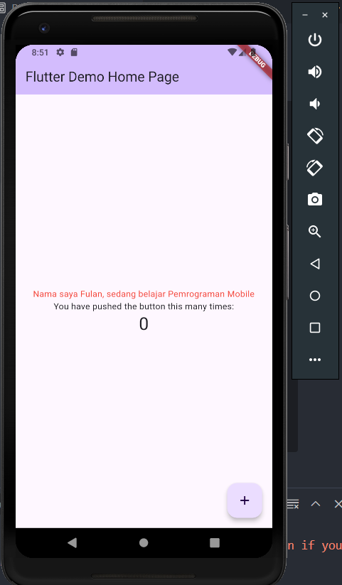

### Langkah 2

Membuat images_widget.dart

```dart
import 'package:flutter/material.dart';

class MyImageWidget extends StatelessWidget {
  const MyImageWidget({Key? key}) : super(key: key);

  @override
  Widget build(BuildContext context) {
    return const Image(image: AssetImage("assets/img_logoPolinema.png"));
  }
}
```

Import widget kedalam main.dart

```dart
children: <Widget>[
            const MyTextWidget(),
            const MyImageWidget(),]
```

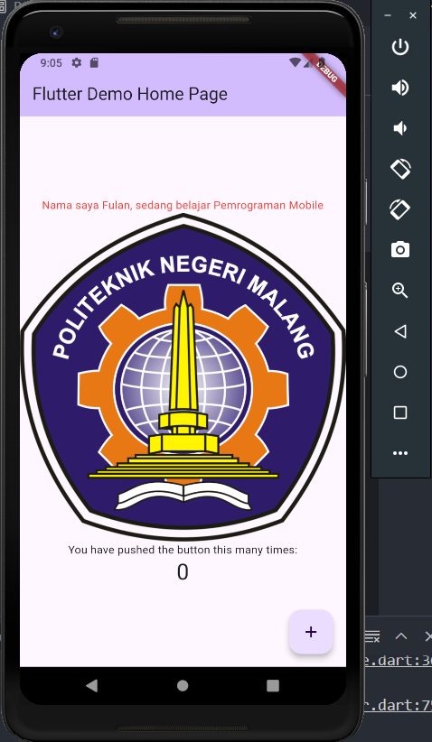

## Menerapkan Widget Material Design dan iOS Cupertino

Penerapan Widget Material dengan desain ala ios (Cuppertino)

### Langkah 1

Loading dan cuppertino button

```dart
class LoadingCupWidget extends StatelessWidget {
  const LoadingCupWidget({Key? key}) : super(key: key);

  @override
  Widget build(BuildContext context) {
    return MaterialApp(
      home: Container(
        margin: const EdgeInsets.only(top: 30),
        color: Colors.white,
        child: Column(
          children: <Widget>[
            CupertinoButton(
              child: const Text("Contoh button"),
              onPressed: () {},
            ),
            const CupertinoActivityIndicator(),
          ],
        ),
      ),
    );
  }
}
```

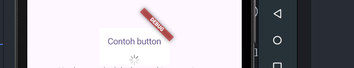

### Langkah 2

Floating action button

```dart
class FabCupWidget extends StatelessWidget {
  final VoidCallback onPressedAction;

  const FabCupWidget({Key? key, required this.onPressedAction})
      : super(key: key);

  @override
  Widget build(BuildContext context) {
    return FloatingActionButton(
      onPressed: onPressedAction,
      child: const Icon(Icons.thumb_up),
      backgroundColor: Colors.pink,
    );
  }
}
```

_main.dart_

```dart
floatingActionButton: FabCupWidget(
          onPressedAction:
              _incrementCounter),
```

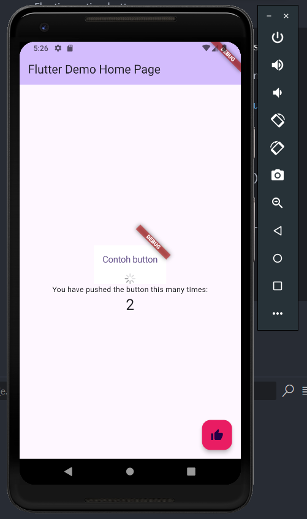

### Langkah 3

Scaffold widget digunakan untuk mengatur tata letak sesuai dengan material design.

```dart
Widget build(BuildContext context) {
    return Scaffold(
      appBar: AppBar(
        title: Text(widget.title),
      ),
      body: Center(
        child: Column(
          mainAxisAlignment: MainAxisAlignment.center,
          children: <Widget>[
            const Text(
              'You have pushed the button this many times:',
            ),
            Text(
              '$_counter',
              style: Theme.of(context).textTheme.headline4,
            ),
          ],
        ),
      ),
      bottomNavigationBar: BottomAppBar(
        child: Container(
          height: 50.0,
        ),
      ),
      floatingActionButton: FloatingActionButton(
        onPressed: _incrementCounter,
        tooltip: 'Increment Counter',
        child: const Icon(Icons.add),
      ),
      floatingActionButtonLocation: FloatingActionButtonLocation.centerDocked,
    );
  }
```

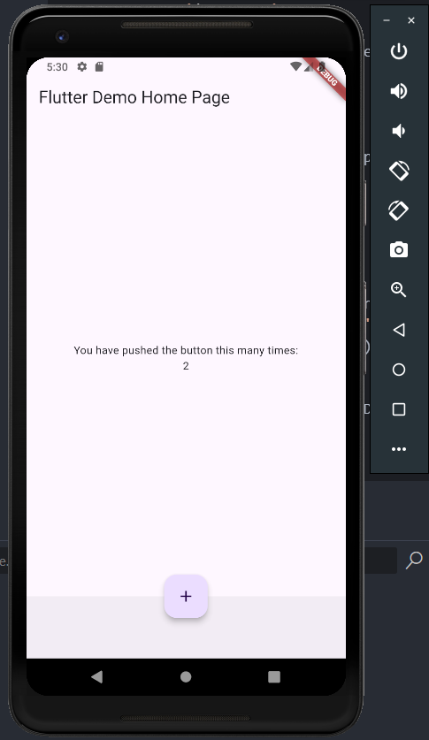

### Langkah 4

Dialog widget pada flutter memiliki dua jenis dialog yaitu AlertDialog dan SimpleDialog.

```dart
class MyApp extends StatelessWidget {
  const MyApp({Key? key}) : super(key: key);

  @override
  Widget build(BuildContext context) {
    return const MaterialApp(
      home: Scaffold(
        body: MyLayout(),
      ),
    );
  }
}

class MyLayout extends StatelessWidget {
  const MyLayout({Key? key}) : super(key: key);

  @override
  Widget build(BuildContext context) {
    return Padding(
      padding: const EdgeInsets.all(8.0),
      child: ElevatedButton(
        child: const Text('Show alert'),
        onPressed: () {
          showAlertDialog(context);
        },
      ),
    );
  }
}

showAlertDialog(BuildContext context) {
  // set up the button
  Widget okButton = TextButton(
    child: const Text("OK"),
    onPressed: () {
      Navigator.pop(context);
    },
  );

  // set up the AlertDialog
  AlertDialog alert = AlertDialog(
    title: const Text("My title"),
    content: const Text("This is my message."),
    actions: [
      okButton,
    ],
  );

  // show the dialog
  showDialog(
    context: context,
    builder: (BuildContext context) {
      return alert;
    },
  );
}
```

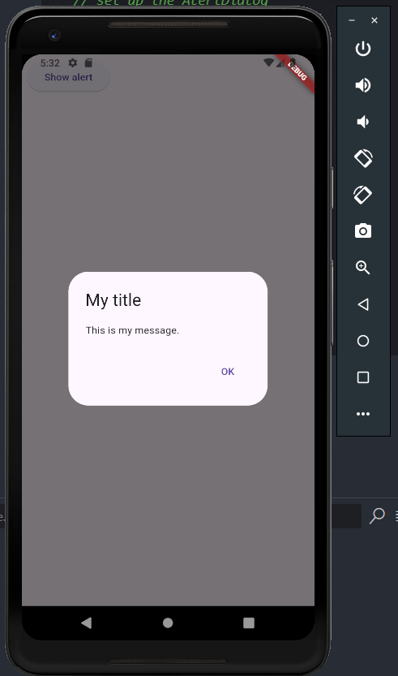

### Langkah 5

Flutter menyediakan widget yang dapat menerima input dari pengguna aplikasi yaitu antara lain Checkbox, Date and Time Pickers, Radio Button, Slider, Switch, TextField.

```dart
class MyApp extends StatelessWidget {
  const MyApp({Key? key}) : super(key: key);

  @override
  Widget build(BuildContext context) {
    return MaterialApp(
      home: Scaffold(
        appBar: AppBar(title: const Text("Contoh TextField")),
        body: const TextField(
          obscureText: false,
          decoration: InputDecoration(
            border: OutlineInputBorder(),
            labelText: 'Nama',
          ),
        ),
      ),
    );
  }
}
```

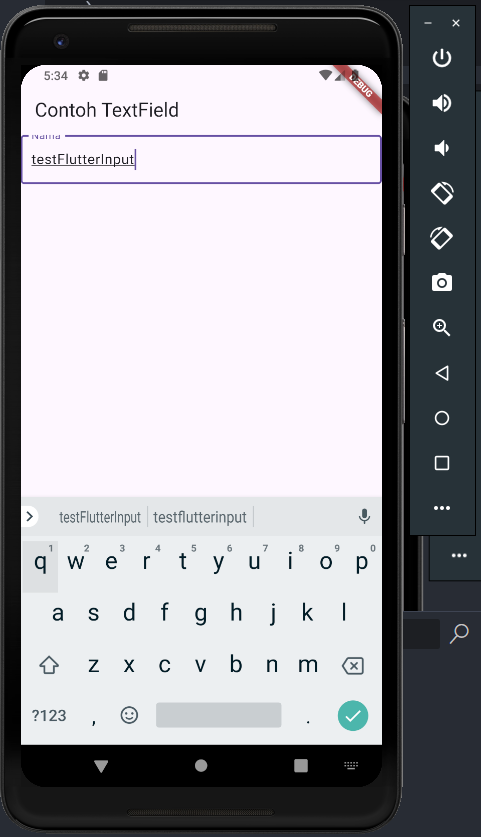

### Langkah 6

Date and Time Pickers termasuk pada kategori input dan selection widget, berikut adalah contoh penggunaan Date and Time Pickers.

```dart
import 'dart:async';
import 'package:flutter/material.dart';

void main() => runApp(const MyApp());

class MyApp extends StatelessWidget {
  const MyApp({Key? key}) : super(key: key);

  @override
  Widget build(BuildContext context) {
    return const MaterialApp(
      title: 'Contoh Date Picker',
      home: MyHomePage(title: 'Contoh Date Picker'),
    );
  }
}

class MyHomePage extends StatefulWidget {
  const MyHomePage({Key? key, required this.title}) : super(key: key);

  final String title;

  @override
  _MyHomePageState createState() => _MyHomePageState();
}

class _MyHomePageState extends State<MyHomePage> {
  // Variable/State untuk mengambil tanggal
  DateTime selectedDate = DateTime.now();

  //  Initial SelectDate FLutter
  Future<void> _selectDate(BuildContext context) async {
    // Initial DateTime FIinal Picked
    final DateTime? picked = await showDatePicker(
        context: context,
        initialDate: selectedDate,
        firstDate: DateTime(2015, 8),
        lastDate: DateTime(2101));
    if (picked != null && picked != selectedDate) {
      setState(() {
        selectedDate = picked;
      });
    }
  }

  @override
  Widget build(BuildContext context) {
    return Scaffold(
      appBar: AppBar(
        title: Text(widget.title),
      ),
      body: Center(
        child: Column(
          mainAxisSize: MainAxisSize.min,
          children: <Widget>[
            Text("${selectedDate.toLocal()}".split(' ')[0]),
            const SizedBox(
              height: 20.0,
            ),
            ElevatedButton(
              onPressed: () => {
                _selectDate(context),
                // ignore: avoid_print
                print(selectedDate.day + selectedDate.month + selectedDate.year)
              },
              child: const Text('Pilih Tanggal'),
            ),
          ],
        ),
      ),
    );
  }
}
```

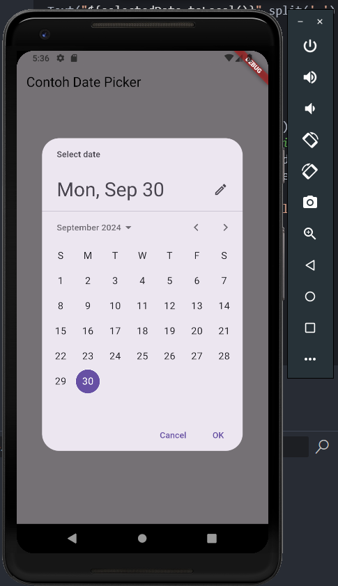

# Tugas

### Menghubungkan ke perangkat fisik dan menjalankan aplikasi Flutter

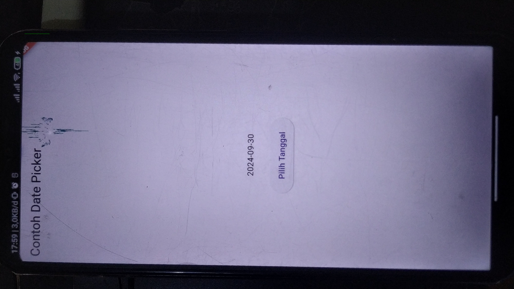

### Buatlah file widget tersendiri di folder basic_widgets, kemudian pada file main.dart cukup melakukan import widget sesuai masing-masing langkah tersebut!

**_Dialog Widget_**

```dart
import 'package:flutter/material.dart';

class DialogWidget extends StatelessWidget {
  const DialogWidget({Key? key}) : super(key: key);

  @override
  Widget build(BuildContext context) {
    return Padding(
      padding: const EdgeInsets.all(8.0),
      child: ElevatedButton(
        child: const Text('Show alert'),
        onPressed: () {
          showAlertDialog(context);
        },
      ),
    );
  }
}

showAlertDialog(BuildContext context) {
  // set up the button
  Widget okButton = TextButton(
    child: const Text("OK"),
    onPressed: () {
      Navigator.pop(context);
    },
  );

  // set up the AlertDialog
  AlertDialog alert = AlertDialog(
    title: const Text("My title"),
    content: const Text("This is my message."),
    actions: [
      okButton,
    ],
  );

  // show the dialog
  showDialog(
    context: context,
    builder: (BuildContext context) {
      return alert;
    },
  );
}

```

**_Input and Section_**

```dart
import 'package:flutter/material.dart';

class InputWidget extends StatelessWidget {
  const InputWidget({Key? key}) : super(key: key);

  @override
  Widget build(BuildContext context) {
    return const Padding(
      padding: EdgeInsets.all(8.0),
      child: TextField(
        obscureText: false,
        decoration: InputDecoration(
          border: OutlineInputBorder(),
          labelText: 'Nama',
        ),
      ),
    );
  }
}
```

**_Date Picker Time_**

```dart
import 'package:flutter/material.dart';
import 'package:pertemuan5/basic_widget/datetime_widget.dart';
import 'package:pertemuan5/basic_widget/dialog_widget.dart';
import 'package:pertemuan5/basic_widget/fab_widget.dart';
import 'package:pertemuan5/basic_widget/image_widget.dart';
import 'package:pertemuan5/basic_widget/input_widget.dart';
import 'package:pertemuan5/basic_widget/loading_cupertino.dart';
import 'package:pertemuan5/basic_widget/text_widget.dart';

void main() {
  runApp(const MyApp());
}

class MyApp extends StatelessWidget {
  const MyApp({super.key});

  // This widget is the root of your application.
  @override
  Widget build(BuildContext context) {
    return MaterialApp(
      title: 'Flutter Demo',
      theme: ThemeData(
        // This is the theme of your application.
        //
        // TRY THIS: Try running your application with "flutter run". You'll see
        // the application has a purple toolbar. Then, without quitting the app,
        // try changing the seedColor in the colorScheme below to Colors.green
        // and then invoke "hot reload" (save your changes or press the "hot
        // reload" button in a Flutter-supported IDE, or press "r" if you used
        // the command line to start the app).
        //
        // Notice that the counter didn't reset back to zero; the application
        // state is not lost during the reload. To reset the state, use hot
        // restart instead.
        //
        // This works for code too, not just values: Most code changes can be
        // tested with just a hot reload.
        colorScheme: ColorScheme.fromSeed(seedColor: Colors.deepPurple),
        useMaterial3: true,
      ),
      home: const MyHomePage(title: 'Flutter Demo Home Page'),
    );
  }
}

class MyHomePage extends StatefulWidget {
  const MyHomePage({super.key, required this.title});

  // This widget is the home page of your application. It is stateful, meaning
  // that it has a State object (defined below) that contains fields that affect
  // how it looks.

  // This class is the configuration for the state. It holds the values (in this
  // case the title) provided by the parent (in this case the App widget) and
  // used by the build method of the State. Fields in a Widget subclass are
  // always marked "final".

  final String title;

  @override
  State<MyHomePage> createState() => _MyHomePageState();
}

class _MyHomePageState extends State<MyHomePage> {
  int _counter = 0;

  void _incrementCounter() {
    setState(() {
      // This call to setState tells the Flutter framework that something has
      // changed in this State, which causes it to rerun the build method below
      // so that the display can reflect the updated values. If we changed
      // _counter without calling setState(), then the build method would not be
      // called again, and so nothing would appear to happen.
      _counter++;
    });
  }

  @override
  Widget build(BuildContext context) {
    // This method is rerun every time setState is called, for instance as done
    // by the _incrementCounter method above.
    //
    // The Flutter framework has been optimized to make rerunning build methods
    // fast, so that you can just rebuild anything that needs updating rather
    // than having to individually change instances of widgets.
    return Scaffold(
      appBar: AppBar(
        // TRY THIS: Try changing the color here to a specific color (to
        // Colors.amber, perhaps?) and trigger a hot reload to see the AppBar
        // change color while the other colors stay the same.
        backgroundColor: Theme.of(context).colorScheme.inversePrimary,
        // Here we take the value from the MyHomePage object that was created by
        // the App.build method, and use it to set our appbar title.
        title: Text(widget.title),
      ),
      body: Center(
        // Center is a layout widget. It takes a single child and positions it
        // in the middle of the parent.
        child: Column(
          // Column is also a layout widget. It takes a list of children and
          // arranges them vertically. By default, it sizes itself to fit its
          // children horizontally, and tries to be as tall as its parent.
          //
          // Column has various properties to control how it sizes itself and
          // how it positions its children. Here we use mainAxisAlignment to
          // center the children vertically; the main axis here is the vertical
          // axis because Columns are vertical (the cross axis would be
          // horizontal).
          //
          // TRY THIS: Invoke "debug painting" (choose the "Toggle Debug Paint"
          // action in the IDE, or press "p" in the console), to see the
          // wireframe for each widget.
          mainAxisAlignment: MainAxisAlignment.center,
          children: <Widget>[
            const LoadingCupWidget(),
            const Text(
              'You have pushed the button this many times:',
            ),
            Text(
              '$_counter',
              style: Theme.of(context).textTheme.headlineMedium,
            ),
            const DialogWidget(),
            const InputWidget(),
            const DatetimeWidget(),
          ],
        ),
      ),
      floatingActionButton: FabCupWidget(
          onPressedAction:
              _incrementCounter), // This trailing comma makes auto-formatting nicer for build methods.
    );
  }
}
```

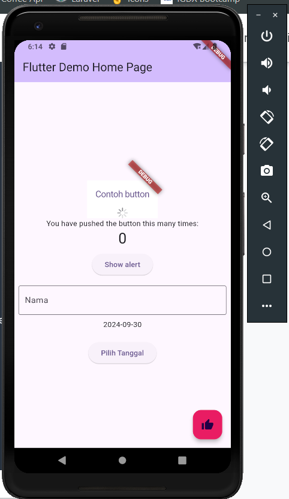
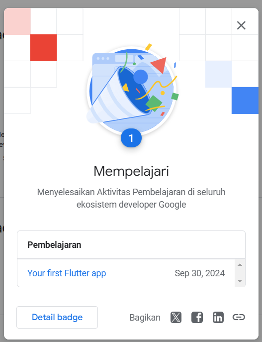
