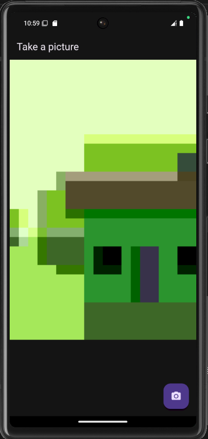
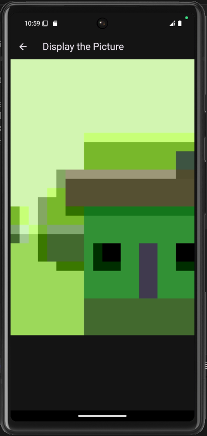

# Kamera

Flutter menyediakan plugin kamera untuk tujuan ini. Plugin kamera menyediakan alat untuk mendapatkan daftar kamera yang tersedia, menampilkan pratinjau yang berasal dari kamera tertentu, dan mengambil foto atau video.

# Praktikum 1

1. Membuat Project Baru

   Buatlah project baru Flutter dengan nama `kamera_flutter` melalui terminal atau command prompt.

   ```bash
   flutter create kamera_flutter
   cd kamera_flutter
   ```

2. Menambah Dependensi yang Diperlukan

   Tambahkan dependensi camera, path_provider, dan path ke dalam project untuk mengakses kamera, menyimpan gambar, dan mendukung path yang sesuai pada berbagai platform.

   Jalankan perintah berikut di terminal:

   ```bash
   flutter pub add camera path_provider path
   ```

3. Mengambil Sensor Kamera dari Perangkat

   Cek dan akses kamera perangkat dengan kode berikut:

   ```dart
   // Pastikan plugin kamera sudah terinisialisasi
   WidgetsFlutterBinding.ensureInitialized();

   // Ambil daftar kamera yang tersedia
   final cameras = await availableCameras();

   // Ambil kamera pertama dari daftar yang ada
   final firstCamera = cameras.first;
   ```

   `lib/main.dart`

   ```dart
   Future<void> main() async {
   ...
   }
   ```

4. Membuat dan Menginisialisasi CameraController

   Buat StatefulWidget dan inisialisasi CameraController untuk mengakses kamera dan menampilkan preview.

   ```dart
   class TakePictureScreen extends StatefulWidget {
   const TakePictureScreen({super.key, required this.camera});
   final CameraDescription camera;

   @override
   TakePictureScreenState createState() => TakePictureScreenState();
   }

   class TakePictureScreenState extends State<TakePictureScreen> {
   late CameraController _controller;
   late Future<void> _initializeControllerFuture;

   @override
   void initState() {
       super.initState();
       _controller = CameraController(
       widget.camera,
       ResolutionPreset.medium,
       );
       _initializeControllerFuture = _controller.initialize();
   }

   @override
   void dispose() {
       _controller.dispose();
       super.dispose();
   }
   }
   ```

5. Menggunakan CameraPreview untuk Menampilkan Preview Foto

   Gunakan CameraPreview untuk menampilkan pratinjau kamera setelah controller diinisialisasi.

   ```dart
   @override
   Widget build(BuildContext context) {
   return Scaffold(
       appBar: AppBar(title: const Text('Take a picture - NIM Anda')),
       body: FutureBuilder<void>(
       future: _initializeControllerFuture,
       builder: (context, snapshot) {
           if (snapshot.connectionState == ConnectionState.done) {
           return CameraPreview(_controller);
           } else {
           return const Center(child: CircularProgressIndicator());
           }
       },
       ),
   );
   }
   ```

6. Mengambil Foto dengan CameraController

   Gunakan FloatingActionButton untuk mengambil gambar dan pastikan kamera sudah diinisialisasi.

   ```dart
   FloatingActionButton(
   onPressed: () async {
       try {
       await _initializeControllerFuture;
       final image = await _controller.takePicture();
       } catch (e) {
       print(e);
       }
   },
   child: const Icon(Icons.camera_alt),
   )
   ```

7. Membuat Widget DisplayPictureScreen

   Buat file baru displaypicture_screen.dart untuk menampilkan gambar yang telah diambil.

   ```dart
   class DisplayPictureScreen extends StatelessWidget {
   final String imagePath;

   const DisplayPictureScreen({super.key, required this.imagePath});

   @override
   Widget build(BuildContext context) {
       return Scaffold(
       appBar: AppBar(title: const Text('Display the Picture - NIM Anda')),
       body: Image.file(File(imagePath)),
       );
   }
   }
   ```

8. Edit main.dart

   Perbarui main.dart agar menggunakan kamera yang dipilih untuk ditampilkan pada aplikasi.

   ```dart
   runApp(
   MaterialApp(
       theme: ThemeData.dark(),
       home: TakePictureScreen(camera: firstCamera),
       debugShowCheckedModeBanner: false,
   ),
   );
   ```

9. Menampilkan Hasil Foto

   Tampilkan hasil foto yang diambil pada DisplayPictureScreen.

   ```dart
   try {
   await _initializeControllerFuture;
   final image = await _controller.takePicture();

   if (!context.mounted) return;

   await Navigator.of(context).push(
       MaterialPageRoute(
       builder: (context) => DisplayPictureScreen(
           imagePath: image.path,
       ),
       ),
   );
   } catch (e) {
   print(e);
   }
   ```

10. hasil

    
    


