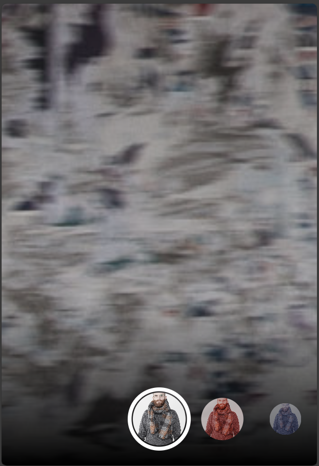
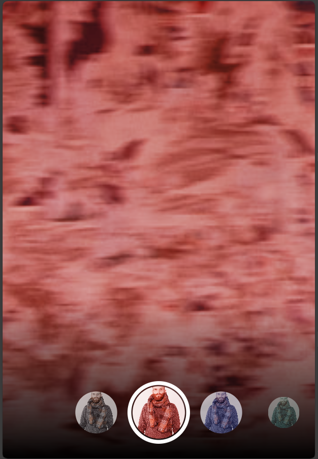

# Kamera

## Praktikum 2

1. Buat Project Baru

   Buatlah project Flutter baru dengan nama photo_filter_carousel.

   ```bash
   flutter create photo_filter_carousel
   cd photo_filter_carousel
   ```

2. Buat Widget Selector Ring dan Dark Gradient

   Buat folder baru bernama widget di dalam folder lib, dan buat file baru dengan nama filter_selector.dart di dalam folder tersebut. Berikut adalah kode untuk widget FilterSelector:

   `lib/widget/filter_selector.dart`

   ```dart
   @immutable
   class FilterSelector extends StatefulWidget {
   const FilterSelector({
       super.key,
       required this.filters,
       required this.onFilterChanged,
       this.padding = const EdgeInsets.symmetric(vertical: 24),
   });

   final List<Color> filters;
   final void Function(Color selectedColor) onFilterChanged;
   final EdgeInsets padding;

   @override
   State<FilterSelector> createState() => _FilterSelectorState();
   }

   class _FilterSelectorState extends State<FilterSelector> {
   static const _filtersPerScreen = 5;
   static const _viewportFractionPerItem = 1.0 / _filtersPerScreen;

   late final PageController _controller;
   late int _page;

   int get filterCount => widget.filters.length;

   Color itemColor(int index) => widget.filters[index % filterCount];

   @override
   void initState() {
       super.initState();
       _page = 0;
       _controller = PageController(
       initialPage: _page,
       viewportFraction: _viewportFractionPerItem,
       );
       _controller.addListener(_onPageChanged);
   }

   void _onPageChanged() {
       final page = (_controller.page ?? 0).round();
       if (page != _page) {
       _page = page;
       widget.onFilterChanged(widget.filters[page]);
       }
   }

   void _onFilterTapped(int index) {
       _controller.animateToPage(
       index,
       duration: const Duration(milliseconds: 450),
       curve: Curves.ease,
       );
   }

   @override
   void dispose() {
       _controller.dispose();
       super.dispose();
   }

   @override
   Widget build(BuildContext context) {
       return Scrollable(
       controller: _controller,
       axisDirection: AxisDirection.right,
       physics: const PageScrollPhysics(),
       viewportBuilder: (context, viewportOffset) {
           return LayoutBuilder(
           builder: (context, constraints) {
               final itemSize = constraints.maxWidth * _viewportFractionPerItem;
               viewportOffset
               ..applyViewportDimension(constraints.maxWidth)
               ..applyContentDimensions(0.0, itemSize * (filterCount - 1));

               return Stack(
               alignment: Alignment.bottomCenter,
               children: [
                   _buildShadowGradient(itemSize),
                   _buildCarousel(
                   viewportOffset: viewportOffset,
                   itemSize: itemSize,
                   ),
                   _buildSelectionRing(itemSize),
               ],
               );
           },
           );
       },
       );
   }

   Widget _buildShadowGradient(double itemSize) {
       return SizedBox(
       height: itemSize * 2 + widget.padding.vertical,
       child: const DecoratedBox(
           decoration: BoxDecoration(
           gradient: LinearGradient(
               begin: Alignment.topCenter,
               end: Alignment.bottomCenter,
               colors: [
               Colors.transparent,
               Colors.black,
               ],
           ),
           ),
           child: SizedBox.expand(),
       ),
       );
   }

   Widget _buildCarousel({
       required ViewportOffset viewportOffset,
       required double itemSize,
   }) {
       return Container(
       height: itemSize,
       margin: widget.padding,
       child: Flow(
           delegate: CarouselFlowDelegate(
           viewportOffset: viewportOffset,
           filtersPerScreen: _filtersPerScreen,
           ),
           children: [
           for (int i = 0; i < filterCount; i++)
               FilterItem(
               onFilterSelected: () => _onFilterTapped(i),
               color: itemColor(i),
               ),
           ],
       ),
       );
   }

   Widget _buildSelectionRing(double itemSize) {
       return IgnorePointer(
       child: Padding(
           padding: widget.padding,
           child: SizedBox(
           width: itemSize,
           height: itemSize,
           child: const DecoratedBox(
               decoration: BoxDecoration(
               shape: BoxShape.circle,
               border: Border.fromBorderSide(
                   BorderSide(width: 6, color: Colors.white),
               ),
               ),
           ),
           ),
       ),
       );
   }
   }
   ```

3. Buat Widget Photo Filter Carousel

   Buat file baru bernama filter_carousel.dart di dalam folder widget. Berikut adalah kode untuk widget PhotoFilterCarousel:

   `lib/widget/filter_carousel.dart`

   ```dart
   @immutable
   class PhotoFilterCarousel extends StatefulWidget {
   const PhotoFilterCarousel({super.key});

   @override
   State<PhotoFilterCarousel> createState() => _PhotoFilterCarouselState();
   }

   class _PhotoFilterCarouselState extends State<PhotoFilterCarousel> {
   final _filters = [
       Colors.white,
       ...List.generate(
       Colors.primaries.length,
       (index) => Colors.primaries[(index * 4) % Colors.primaries.length],
       )
   ];

   final _filterColor = ValueNotifier<Color>(Colors.white);

   void _onFilterChanged(Color value) {
       _filterColor.value = value;
   }

   @override
   Widget build(BuildContext context) {
       return Material(
       color: Colors.black,
       child: Stack(
           children: [
           Positioned.fill(
               child: _buildPhotoWithFilter(),
           ),
           Positioned(
               left: 0.0,
               right: 0.0,
               bottom: 0.0,
               child: _buildFilterSelector(),
           ),
           ],
       ),
       );
   }

   Widget _buildPhotoWithFilter() {
       return ValueListenableBuilder(
       valueListenable: _filterColor,
       builder: (context, color, child) {
           return Image.network(
           'https://docs.flutter.dev/cookbook/img-files'
           '/effects/instagram-buttons/millennial-dude.jpg',
           color: color.withOpacity(0.5),
           colorBlendMode: BlendMode.color,
           fit: BoxFit.cover,
           );
       },
       );
   }

   Widget _buildFilterSelector() {
       return FilterSelector(
       onFilterChanged: _onFilterChanged,
       filters: _filters,
       );
   }
   }
   ```

4. Membuat Filter Warna - Bagian 1

   Buat file baru bernama carousel_flowdelegate.dart di dalam folder widget. Berikut adalah kode untuk CarouselFlowDelegate:

   `lib/widget/carousel_flowdelegate.dart`

   ```dart
   class CarouselFlowDelegate extends FlowDelegate {
   CarouselFlowDelegate({
       required this.viewportOffset,
       required this.filtersPerScreen,
   }) : super(repaint: viewportOffset);

   final ViewportOffset viewportOffset;
   final int filtersPerScreen;

   @override
   void paintChildren(FlowPaintingContext context) {
       final count = context.childCount;

       final size = context.size.width;

       final itemExtent = size / filtersPerScreen;

       final active = viewportOffset.pixels / itemExtent;

       final min = math.max(0, active.floor() - 3).toInt();

       final max = math.min(count - 1, active.ceil() + 3).toInt();

       for (var index = min; index <= max; index++) {
       final itemXFromCenter = itemExtent * index - viewportOffset.pixels;
       final percentFromCenter = 1.0 - (itemXFromCenter / (size / 2)).abs();
       final itemScale = 0.5 + (percentFromCenter * 0.5);
       final opacity = 0.25 + (percentFromCenter * 0.75);

       final itemTransform = Matrix4.identity()
           ..translate((size - itemExtent) / 2)
           ..translate(itemXFromCenter)
           ..translate(itemExtent / 2, itemExtent / 2)
           ..multiply(Matrix4.diagonal3Values(itemScale, itemScale, 1.0))
           ..translate(-itemExtent / 2, -itemExtent / 2);

       context.paintChild(
           index,
           transform: itemTransform,
           opacity: opacity,
       );
       }
   }

   @override
   bool shouldRepaint(covariant CarouselFlowDelegate oldDelegate) {
       return oldDelegate.viewportOffset != viewportOffset;
   }
   }
   ```

5. Membuat Filter Warna

   Buat file baru bernama filter_item.dart di dalam folder widget. Berikut adalah kode untuk FilterItem:

   `lib/widget/filter_item.dart`

   ```dart
   @immutable
   class FilterItem extends StatelessWidget {
   const FilterItem({
       super.key,
       required this.color,
       this.onFilterSelected,
   });

   final Color color;
   final VoidCallback? onFilterSelected;

   @override
   Widget build(BuildContext context) {
       return GestureDetector(
       onTap: onFilterSelected,
       child: AspectRatio(
           aspectRatio: 1.0,
           child: Padding(
           padding: const EdgeInsets.all(8),
           child: ClipOval(
               child: Image.network(
               'https://docs.flutter.dev/cookbook/img-files/effects/instagram-buttons/millennial-dude.jpg',
               color: color.withOpacity(0.5),
               colorBlendMode: BlendMode.color,
               fit: BoxFit.cover,
               ),
           ),
           ),
       ),
       );
   }
   }
   ```

6. Implementasi di main.dart

   Buka file lib/main.dart dan implementasikan PhotoFilterCarousel sebagai tampilan utama:

   ```dart
   import 'package:flutter/material.dart';
   import 'package:photo_filter_carousel/widget/filter_carousel.dart';

   void main() {
   runApp(const MyApp());
   }

   class MyApp extends StatelessWidget {
   const MyApp({super.key});

   @override
   Widget build(BuildContext context) {
       return MaterialApp(
       debugShowCheckedModeBanner: false,
       title: 'Photo Filter Carousel',
       theme: ThemeData.dark(),
       home: const PhotoFilterCarousel(),
       );
   }
   }
   ```

7. hasil

   
   
