# Pemrograman Asynchronous

Pemrograman asynchronous (async) dimanfaatkan untuk aplikasi menyelesaikan tugas-tugas yang membutuhkan waktu (user harus menunggu hasilnya). Contohnya seperti mengunduh gambar dari web, menulis data ke web server, mengerjakan tugas paralel lainnya, hingga menangani inputan dari user. Dengan pemrograman async ini akan meningkatkan kualitas UX dan perangkat lunak kita.

## Praktikum 1

1. Buat Project Baru dan tambahkan dependensi http

   ```bash
   flutter pub add http
   ```

2. Cek file `pubspec.yaml`

   ```yaml
   dependencies:
     flutter:
       sdk: flutter
     cupertino_icons: ^1.0.8
     http: ^1.2.2
   ```

3. Buka file `main.dart`

   ```dart
   import 'package:flutter/material.dart';

   void main() {
       runApp(const MyApp());
   }

   class MyApp extends StatelessWidget {
       const MyApp({super.key});

       @override
       Widget build(BuildContext context) {
           return MaterialApp(
           title: 'Flutter Demo',
           theme: ThemeData(
               colorScheme: ColorScheme.fromSeed(seedColor: Colors.blue),
               useMaterial3: true,
               visualDensity: VisualDensity.adaptivePlatformDensity,
           ),
           home: const FuturePage(),
           );
       }
   }

   class FuturePage extends StatefulWidget {
       const FuturePage({super.key});

       @override
       State<FuturePage> createState() => _FuturePageState();
   }

   class _FuturePageState extends State<FuturePage> {
       String result = '';

       @override
       Widget build(BuildContext context) {
           return Scaffold(
               appBar: AppBar(
                   title: const Text('Back from the Future'),
               ),
               body: Center(
                   child: Column(
                       children: [
                           const Spacer(),
                           ElevatedButton(onPressed: () {}, child: const Text('GO!')),
                           const Spacer(),
                           Text(result),
                           const Spacer(),
                           const CircularProgressIndicator(),
                           const Spacer(),
                       ],
                   ),
               ),
           );
       }
   }
   ```

   - Soal 1
     > ```dart
     >   title: 'By'
     > ```

4. Tambah method `getData()`

   ```dart
   Future<Response> getData() async {
       const authority = 'www.googleapis.com';
       const path = '/books/v1/volumes/junbDwAAQBAJ';
       Uri url = Uri.https(authority, path);
       return http.get(url);
   }
   ```

   - Soal 2
     > ```dart
     > const path = '/books/v1/volumes/jWTvDwAAQBAJ';
     > ```

   > 

5. Tambah kode di ElevatedButton

   ```dart
   onPressed: () {
       setState(() {
           getData().then((value) {
               result = value.body.toString().substring(0, 450);
               setState(() {});
           }).catchError((_) {
               result = 'An error occurred';
               setState(() {});
           });
       });
   }
   ```

   - Soal 3
     > - `substring(0, 450)` mengambil potongan teks dari indeks ke-0 hingga ke-449.
     > - `.catchError((_) { ... })` digunakan untuk menangani error yang terjadi selama proses getData().

   > 

6. Hasil

   

## Praktikum 2

1. Buka file `main.dart`

   Tambahkan tiga method berisi kode seperti berikut di dalam class \_FuturePageState.

   ```dart
   Future<int> returnOneAsync() async {
       await Future.delayed(const Duration(seconds: 3));
       return 1;
   }

   Future<int> returnTwoAsync() async {
       await Future.delayed(const Duration(seconds: 3));
       return 2;
   }

   Future<int> returnThreeAsync() async {
       await Future.delayed(const Duration(seconds: 3));
       return 3;
   }
   ```

2. Tambah method `count()`

   ```dart
   Future count() async {
       int total = 0;
       total = await returnOneAsync();
       total += await returnTwoAsync();
       total += await returnThreeAsync();
       setState(() {
       result = total.toString();
       });
   }
   ```

3. Panggil `count()`

   ```dart
   ElevatedButton(
       onPressed: () {
           count();
       },
       child: const Text('GO!'),
   ),
   ```

4. Hasil

   

   - Soal 4
     > - Ketiga method (`returnOneAsync`, `returnTwoAsync`, dan `returnThreeAsync`) adalah fungsi asynchronous yang masing-masing mengembalikan nilai integer (1, 2, dan 3). Setelah delay selama 3 detik, masing-masing fungsi akan mengembalikan nilai integer (1, 2, atau 3).
     > - Method `count()` adalah fungsi asynchronous yang digunakan untuk menghitung total dari hasil ketiga fungsi di atas.

   > 

## Praktikum 3

1. Buka `main.dart`

   Pastikan telah impor package async berikut.

   ```dart
   import 'package:async/async.dart';
   ```

2. Tambahkan variabel dan method

   ```dart
   late Completer completer;

   Future getNumber() {
       completer = Completer<int>();
       calculate();
       return completer.future;
   }

   Future calculate() async {
       await Future.delayed(const Duration(seconds : 5));
       completer.complete(42);
   }
   ```

3. Ganti isi kode `onPressed()`

   ```dart
   getNumber().then((value) {
       setState(() {
           result = value.toString();
       });
   });
   ```

4. Hasil

   

   - Soal 5
     > - Kode ini menggunakan _Completer_ untuk mengontrol kapan sebuah _Future_ selesai. Fungsi `getNumber()` membuat `Completer<int>`, memanggil `calculate()`, dan mengembalikan _Future_ yang belum selesai. Fungsi `calculate()` menunggu 5 detik dengan _Future.delayed_, lalu menyelesaikan _Future_ tersebut dengan nilai 42 menggunakan `completer.complete(42)`. Hasilnya, _Future_ yang dikembalikan oleh `getNumber()` akan selesai dengan nilai 42 setelah 5 detik, memungkinkan kontrol manual atas penyelesaian _Future_ tersebut.

   > 

5. Ganti method `calculate()`

   ```dart
   Future calculate() async {
       try {
           await Future.delayed(const Duration(seconds: 5));
           completer.complete(42);
       } catch (_) {
           completer.completeError({});
       }
   }
   ```

6. Pindah ke `onPressed()`

   ```dart
   getNumber().then((value) {
       setState(() {
           result = value.toString();
       });
   }).catchError((e) {
       result = 'An error occurred';
   });
   ```

   - Soal 6
     > - Perbedaan antara langkah 2 dan langkah 5-6 ada di **Error Handler**. Pada langkah 2, method `calculate()` hanya menyelesaikan _Future_ dengan nilai 42 setelah 5 detik tanpa penanganan error. Sementara itu, pada langkah 5, `calculate()` menggunakan blok **`try-catch`**, sehingga jika terjadi error, `completer.completeError({})` akan dipanggil untuk menandai _Future_ sebagai gagal. Di langkah 6, onPressed() diperbarui untuk menangani keberhasilan dengan then() yang menampilkan hasil, atau `catchError()` untuk menampilkan pesan error, sehingga aplikasi dapat menampilkan respons yang sesuai tergantung pada apakah Future berhasil atau gagal.

   > 

## Praktikum 4

1. Buka file main.dart

   Tambahkan method ini ke dalam class `_FuturePageState`

   ```dart
   void returnFG() {
       FutureGroup<int> futureGroup = FutureGroup<int>();
       futureGroup.add(returnOneAsync());
       futureGroup.add(returnTwoAsync());
       futureGroup.add(returnThreeAsync());
       futureGroup.close();
       futureGroup.future.then((List<int> value) {
           int total = 0;
           for (var element in value) {
               total += element;
           }
           setState(() {
               result = total.toString();
           });
       });
   }
   ```

2. Edit `onPressed()`

   ```dart
   onPressed: () {
       returnFG();
   },
   ```

3. Hasil
   

   - Soal 7
     >  > 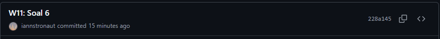

4. Ganti variabel futureGroup

   ```dart
   final futures = Future.wait<int>([
     returnOneAsync(),
     returnTwoAsync(),
     returnThreeAsync(),
   ]);
   ```

   - Soal 8
     > - Pada langkah 1, kode menggunakan `FutureGroup<int>`, yang memungkinkan penambahan Future secara bertahap sebelum ditutup dengan `futureGroup.close()`, kemudian menunggu hingga semua _Future_ selesai untuk menghitung total.
     > - pada langkah 4, kode menggunakan `Future.wait<int>()`, yang lebih ringkas karena langsung menunggu semua Future dalam daftar (`returnOneAsync()`, `returnTwoAsync()`, `returnThreeAsync()`) selesai secara bersamaan tanpa perlu penambahan Future secara manual atau pemanggilan `.close()`.

## Praktikum 5

1. Buka file main.dart

   ```dart
   Future returnError() async {
       await Future.delayed(const Duration(seconds: 2));
       throw Exception('Something terrible happened');
   }
   ```

2. ElevatedButton

   ```dart
   returnError().then((value) {
       setState(() {
           result = 'Success';
       });
   }).catchError((onError){
       setState(() {
           result = onError.toString();
       });
   }).whenComplete(() => print('Complete'));
   ```

3. Hasil
   

   - Soal 9
     > 

4. Tambah method `handleError()`

   ```dart
   Future handleError() async {
       try {
           await returnError();
       } catch (error) {
           setState(() {
               result = error.toString();
       });
       } finally {
           print('Complete');
       }
   }
   ```

   - Soal 10
     > ```dart
     > handleError();
     > ```
     >
     > 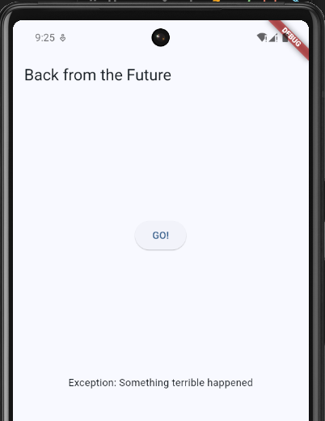
     >
     > - Pada langkah 1, method `returnError()` secara sengaja melempar sebuah Exception setelah penundaan 2 detik tanpa menangani kesalahan tersebut.
     > - Pada langkah 4, method `handleError()` menambahkan penanganan error menggunakan blok _try-catch_, di mana error yang dilempar oleh `returnError()` akan ditangkap dan ditampilkan di UI melalui `setState()`. Selain itu, blok _finally_ memastikan bahwa pesan "Complete" akan dicetak ke konsol terlepas dari apakah terjadi error atau tidak, menandakan bahwa eksekusi telah selesai.

## Praktikum 6

1. install plugin geolocator

   ```bash
   flutter pub add geolocator
   ```

2. Tambah permission GPS

   ```xml
   <uses-permission android:name="android.permission.ACCESS_FINE_LOCATION"/>
   <uses-permission android:name="android.permission.ACCESS_COARSE_LOCATION"/>
   ```

3. Buat file `geolocation.dart`

   Buat StatefulWidget lalu Isi kode geolocation.dart

   ```dart
   import 'package:flutter/material.dart';
   import 'package:geolocator/geolocator.dart';

   class LocationScreen extends StatefulWidget {
       const LocationScreen({super.key});

       @override
       State<LocationScreen> createState() => _LocationScreenState();
       }

   class _LocationScreenState extends State<LocationScreen> {
       String myPosition = '';

       @override
       void initState() {
           super.initState();
           getPosition().then((Position myPos) {
           myPosition =
               'Latitude: ${myPos.latitude.toString()} - Longitude: ${myPos.longitude.toString()}';
           });
       }

       @override
       Widget build(BuildContext context) {
           return Scaffold(
               appBar: AppBar(
                   title: const Text("Current Location By"),
               ),
               body: Center(
                   child: Text(myPosition),
               ),
           );
       }

       Future<Position> getPosition() async {
           await Geolocator.requestPermission();
           await Geolocator.isLocationServiceEnabled();
           Position? position = await Geolocator.getCurrentPosition();
           return position;
       }
   }
   ```

   - Soal 11
     > `dart title: const Text("Current Location By")`

4. Edit main.dart

   ```dart
   home: LocationScreen(),
   ```

5. Hasil
   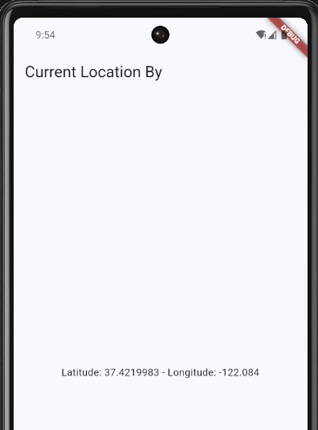

6. Tambahkan animasi loading

   ```dart
   @override
   Widget build(BuildContext context) {
       final myWidget = myPosition == ''
           ? const CircularProgressIndicator()
           : Text(myPosition);
       ;
       return Scaffold(
           appBar: AppBar(
               title: const Text("Current Location By"),
           ),
           body: Center(
               child: myWidget,
           ),
       );
   }
   ```

   - Soal 12
     > 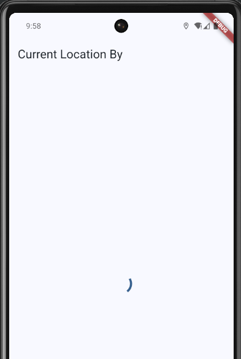 >  > 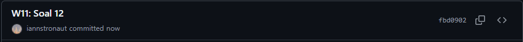

## Praktikum 7

1. Modifikasi method `getPosition()`

   ```dart
   Future<Position> getPosition() async {
       await Geolocator.isLocationServiceEnabled();
       await Future.delayed(const Duration(seconds: 3));
       Position position = await Geolocator.getCurrentPosition();
       return position;
   }
   ```

2. Tambah variabel

   ```dart
   Future<Position>? position;
   ```

3. Tambah `initState()`

   ```dart
   @override
   void initState() {
       super.initState();
       position = getPosition();
   }
   ```

4. Edit method `build()`

   ```dart
   @override
   Widget build(BuildContext context) {
       return Scaffold(
           appBar: AppBar(
               title: const Text("Current Location By"),
           ),
           body: Center(
               child: FutureBuilder(
                   future: position,
                   builder: (BuildContext context, AsyncSnapshot<Position> snapshot) {
                       if (snapshot.connectionState == ConnectionState.waiting) {
                           return const CircularProgressIndicator();
                       } else if (snapshot.connectionState == ConnectionState.done) {
                           if (snapshot.hasError) {
                           return Text('Something terrible happened!');
                       }
                       return Text(snapshot.data.toString());
                       } else {
                           return const Text('');
                       }
                   },
               ),
           ),
       );
   }
   ```

5. Hasil
   

   > - Tidak ada perbedaan UI karna pada dasarnya kedua kode sama sama menghasilkan hasil yang sama
   >    > 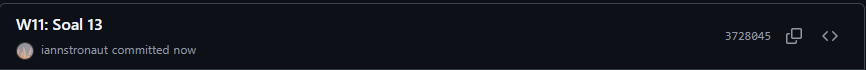

6. Tambah handling error

   ```dart
   if (snapshot.hasError) {
       return Text('Something terrible happened!');
   }
   return Text(snapshot.data.toString());
   ```

   - Soal 14
     > - Perubahan UI Terdapat jika terjadi error, jika error terjadi maka akan mengembalikan 'Something terrible happened!'
     >    > 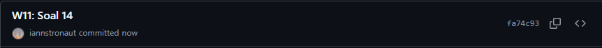

## Praktikum 8

1.  Buat file baru `navigation_first.dart`

2.  Isi kode navigation_first.dart

    ```dart
    import 'package:flutter/material.dart';

        class NavigationFirst extends StatefulWidget {
        const NavigationFirst({super.key});

        @override
        State<NavigationFirst> createState() => _NavigationFirstState();
    }

    class _NavigationFirstState extends State<NavigationFirst> {
        Color color = Colors.blue.shade700;
        @override
        Widget build(BuildContext context) {
            return Scaffold(
                backgroundColor: color,
                appBar: AppBar(
                    title: const Text('Navigation First Screen By'),
                ),
                body: Center(
                    child: ElevatedButton(
                    onPressed: () {
                        _navigateAndGetColor(context);
                    },
                    child: const Text('Change Color'),
                    ),
                ),
            );
        }
    }
    ```

    - Soal 15
      > title: const Text('Navigation First Screen By')

3.  Tambah method di class \_NavigationFirstState

    ```dart
    Future _navigateAndGetColor(BuildContext context) async {
        color = await Navigator.push(
        context,
        MaterialPageRoute(builder: (context) => const NavigationSecond()),
        );
    }
    ```

4.  Buat file baru `navigation_second.dart`

5.  Buat class NavigationSecond dengan StatefulWidget

    ```dart
    import 'package:flutter/material.dart';

    class NavigationSecond extends StatefulWidget {
        const NavigationSecond({super.key});

        @override
        State<NavigationSecond> createState() => _NavigationSecondState();
    }

    class _NavigationSecondState extends State<NavigationSecond> {
        @override
        Widget build(BuildContext context) {
            Color color;
            return Scaffold(
                appBar: AppBar(
                    title: const Text("Navigation Second Screen By"),
                ),
                body: Center(
                    child: Column(
                    mainAxisAlignment: MainAxisAlignment.spaceEvenly,
                    children: [
                            ElevatedButton(
                            onPressed: () {
                                color = Colors.red.shade700;
                            },
                            child: const Text("Red"),
                            ),
                            ElevatedButton(
                            onPressed: () {
                                color = Colors.green.shade700;
                            },
                            child: const Text("Green"),
                            ),
                            ElevatedButton(
                            onPressed: () {
                                color = Colors.blue.shade700;
                            },
                            child: const Text("Blue"),
                            ),
                        ],
                    ),
                ),
            );
        }
    }
    ```

6.  Edit main.dart

    ```dart
    home: const NavigationFirst(),
    ```

    - Soal 16

      > - Ketika button di klik akan mengubah warna pada NavigationFirstScreen
      >
      > ```dart
      > Column(
      > ```

            mainAxisAlignment: MainAxisAlignment.spaceEvenly,
            children: [
              ElevatedButton(
                onPressed: () {
                  // Ubah warna menjadi merah dan kembalikan ke halaman sebelumnya
                  Navigator.pop(context, Colors.red.shade700);
                },
                child: const Text("Red"),
              ),
              ElevatedButton(
                onPressed: () {
                  // Ubah warna menjadi hijau dan kembalikan ke halaman sebelumnya
                  Navigator.pop(context, Colors.green.shade700);
                },
                child: const Text("Green"),
              ),
              ElevatedButton(
                onPressed: () {
                  // Ubah warna menjadi biru dan kembalikan ke halaman sebelumnya
                  Navigator.pop(context, Colors.blue.shade700);
                },
                child: const Text("Blue"),
              ),
              ElevatedButton(
                onPressed: () {
                  // Ubah warna menjadi biru dan kembalikan ke halaman sebelumnya
                  Navigator.pop(context, Colors.purple.shade700);
                },
                child: const Text("Purple"),
              ),
              ElevatedButton(
                onPressed: () {
                  // Ubah warna menjadi biru dan kembalikan ke halaman sebelumnya
                  Navigator.pop(context, Colors.orange.shade700);
                },
                child: const Text("Orange"),
              ),
            ],
            ),

      > ```
      > Menjadi 5 Warna
      > ```
      >
      > 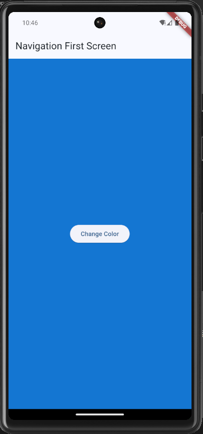 > 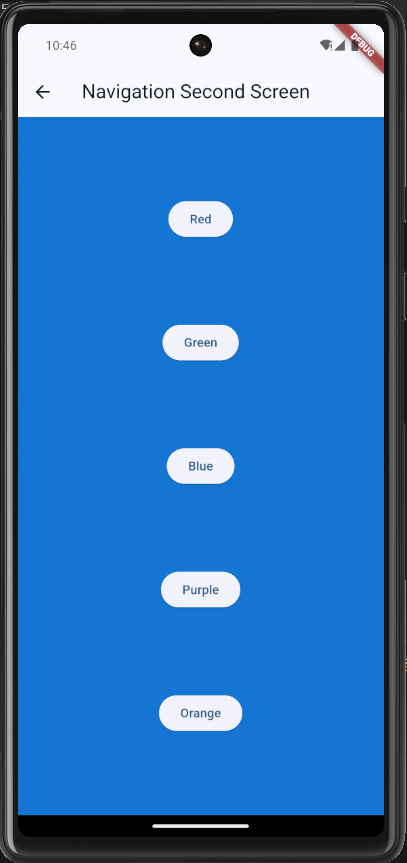 > 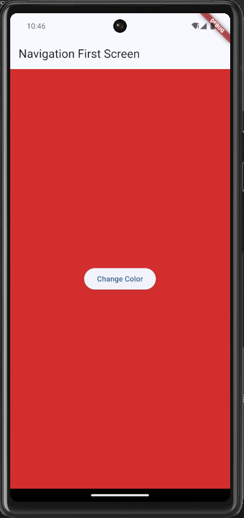

      > 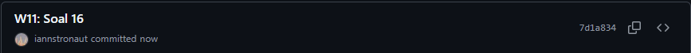

## Praktikum 9

1. Buat file baru `navigation_dialog.dart`

2. Isi kode `navigation_dialog.dart`

   ```dart
   import 'package:flutter/material.dart';

   class NavigationDialogScreen extends StatefulWidget {
       const NavigationDialogScreen({super.key});

       @override
       State<NavigationDialogScreen> createState() => _NavigationDialogScreenState();
   }

   class _NavigationDialogScreenState extends State<NavigationDialogScreen> {
       Color color = Colors.blue.shade700;
       @override
       Widget build(BuildContext context) {
           return Scaffold(
               backgroundColor: color,
               appBar: AppBar(
                   title: const Text('Navigation Dialogue Screen'),
               ),
               body: Center(
                   child:
                       ElevatedButton(onPressed: () {}, child: const Text("Change Color"),
                   ),
               ),
           );
       }
   }
   ```

3. Tambah method async

   ```dart
   _showColorDialog(BuildContext context) async {
       await showDialog(
           context: context,
           builder: (_) {
               return AlertDialog(
               title: const Text('Very important question'),
               content: const Text('Please choose a color'),
               actions: <Widget>[
                       TextButton(
                       onPressed: () {
                           color = Colors.red.shade700;
                       },
                       child: const Text("Red"),
                       ),
                       TextButton(
                       onPressed: () {
                           color = Colors.green.shade700;
                       },
                       child: const Text("Green"),
                       ),
                       TextButton(
                       onPressed: () {
                           color = Colors.blue.shade700;
                       },
                       child: const Text("Blue"),
                       ),
                   ],
               );
           },
       );
   }
   ```

4. Panggil method di ElevatedButton

   ```dart
   onPressed: () {
       _showColorDialog(context);
   }
   ```

5. Edit `main.dart`

   ```dart
   home: const NavigationDialogScreen()
   ```

6. Hasil
   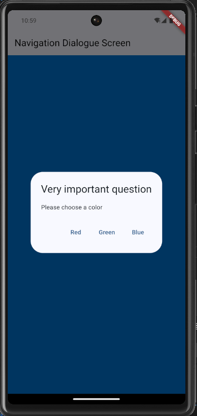

   - Soal 17

   ```dart
   <Widget>[
           TextButton(
             onPressed: () {
               color = Colors.red.shade700;
             },
             child: const Text("Red"),
           ),
           TextButton(
             onPressed: () {
               color = Colors.green.shade700;
             },
             child: const Text("Green"),
           ),
           TextButton(
             onPressed: () {
               color = Colors.blue.shade700;
             },
             child: const Text("Blue"),
           ),
           TextButton(
             onPressed: () {
               color = Colors.purple.shade700;
             },
             child: const Text("Purple"),
           ),
           TextButton(
             onPressed: () {
               color = Colors.orange.shade700;
             },
             child: const Text("Orange"),
           ),
         ],
   ```

   > 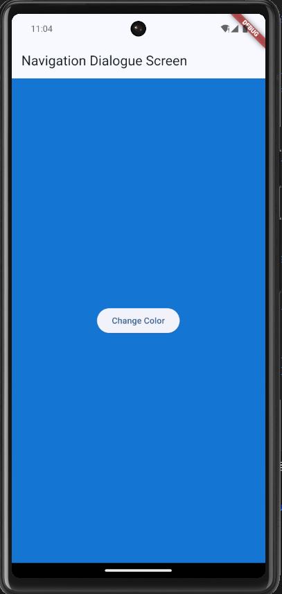 > 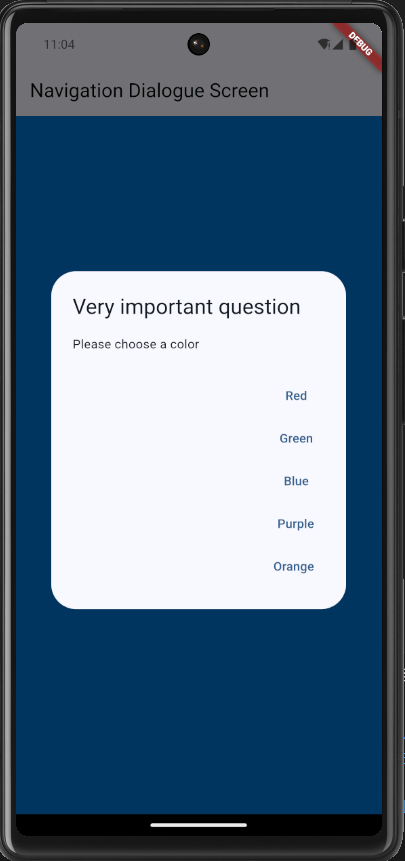 > 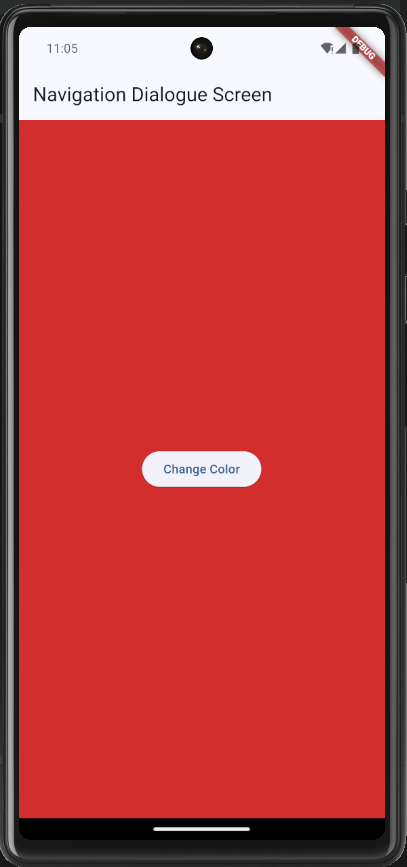

   >
