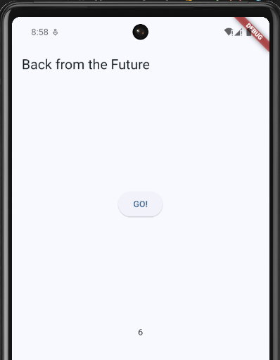

# Pemrograman Asynchronous

Pemrograman asynchronous (async) dimanfaatkan untuk aplikasi menyelesaikan tugas-tugas yang membutuhkan waktu (user harus menunggu hasilnya). Contohnya seperti mengunduh gambar dari web, menulis data ke web server, mengerjakan tugas paralel lainnya, hingga menangani inputan dari user. Dengan pemrograman async ini akan meningkatkan kualitas UX dan perangkat lunak kita.

## Praktikum 1

1. Buat Project Baru dan tambahkan dependensi http

   ```bash
   flutter pub add http
   ```

2. Cek file `pubspec.yaml`

   ```yaml
   dependencies:
     flutter:
       sdk: flutter
     cupertino_icons: ^1.0.8
     http: ^1.2.2
   ```

3. Buka file `main.dart`

   ```dart
   import 'package:flutter/material.dart';

   void main() {
       runApp(const MyApp());
   }

   class MyApp extends StatelessWidget {
       const MyApp({super.key});

       @override
       Widget build(BuildContext context) {
           return MaterialApp(
           title: 'Flutter Demo',
           theme: ThemeData(
               colorScheme: ColorScheme.fromSeed(seedColor: Colors.blue),
               useMaterial3: true,
               visualDensity: VisualDensity.adaptivePlatformDensity,
           ),
           home: const FuturePage(),
           );
       }
   }

   class FuturePage extends StatefulWidget {
       const FuturePage({super.key});

       @override
       State<FuturePage> createState() => _FuturePageState();
   }

   class _FuturePageState extends State<FuturePage> {
       String result = '';

       @override
       Widget build(BuildContext context) {
           return Scaffold(
               appBar: AppBar(
                   title: const Text('Back from the Future'),
               ),
               body: Center(
                   child: Column(
                       children: [
                           const Spacer(),
                           ElevatedButton(onPressed: () {}, child: const Text('GO!')),
                           const Spacer(),
                           Text(result),
                           const Spacer(),
                           const CircularProgressIndicator(),
                           const Spacer(),
                       ],
                   ),
               ),
           );
       }
   }
   ```

   - Soal 1
     > ```dart
     >   title: 'By'
     > ```

4. Tambah method `getData()`

   ```dart
   Future<Response> getData() async {
       const authority = 'www.googleapis.com';
       const path = '/books/v1/volumes/junbDwAAQBAJ';
       Uri url = Uri.https(authority, path);
       return http.get(url);
   }
   ```

   - Soal 2
     > ```dart
     > const path = '/books/v1/volumes/jWTvDwAAQBAJ';
     > ```

   > 

5. Tambah kode di ElevatedButton

   ```dart
   onPressed: () {
       setState(() {
           getData().then((value) {
               result = value.body.toString().substring(0, 450);
               setState(() {});
           }).catchError((_) {
               result = 'An error occurred';
               setState(() {});
           });
       });
   }
   ```

   - Soal 3
     > - `substring(0, 450)` mengambil potongan teks dari indeks ke-0 hingga ke-449.
     > - `.catchError((_) { ... })` digunakan untuk menangani error yang terjadi selama proses getData().

   > 

6. Hasil

   

## Praktikum 2

1. Buka file `main.dart`

   Tambahkan tiga method berisi kode seperti berikut di dalam class \_FuturePageState.

   ```dart
   Future<int> returnOneAsync() async {
       await Future.delayed(const Duration(seconds: 3));
       return 1;
   }

   Future<int> returnTwoAsync() async {
       await Future.delayed(const Duration(seconds: 3));
       return 2;
   }

   Future<int> returnThreeAsync() async {
       await Future.delayed(const Duration(seconds: 3));
       return 3;
   }
   ```

2. Tambah method `count()`

   ```dart
   Future count() async {
       int total = 0;
       total = await returnOneAsync();
       total += await returnTwoAsync();
       total += await returnThreeAsync();
       setState(() {
       result = total.toString();
       });
   }
   ```

3. Panggil `count()`

   ```dart
   ElevatedButton(
       onPressed: () {
           count();
       },
       child: const Text('GO!'),
   ),
   ```

4. Hasil

   

   - Soal 4
     > - Ketiga method (`returnOneAsync`, `returnTwoAsync`, dan `returnThreeAsync`) adalah fungsi asynchronous yang masing-masing mengembalikan nilai integer (1, 2, dan 3). Setelah delay selama 3 detik, masing-masing fungsi akan mengembalikan nilai integer (1, 2, atau 3).
     > - Method `count()` adalah fungsi asynchronous yang digunakan untuk menghitung total dari hasil ketiga fungsi di atas.

   > 

## Praktikum 3

1. Buka `main.dart`

   Pastikan telah impor package async berikut.

   ```dart
   import 'package:async/async.dart';
   ```

2. Tambahkan variabel dan method

   ```dart
   late Completer completer;

   Future getNumber() {
       completer = Completer<int>();
       calculate();
       return completer.future;
   }

   Future calculate() async {
       await Future.delayed(const Duration(seconds : 5));
       completer.complete(42);
   }
   ```

3. Ganti isi kode `onPressed()`

   ```dart
   getNumber().then((value) {
       setState(() {
           result = value.toString();
       });
   });
   ```

4. Hasil

   

   - Soal 5
     > - Kode ini menggunakan _Completer_ untuk mengontrol kapan sebuah _Future_ selesai. Fungsi `getNumber()` membuat `Completer<int>`, memanggil `calculate()`, dan mengembalikan _Future_ yang belum selesai. Fungsi `calculate()` menunggu 5 detik dengan _Future.delayed_, lalu menyelesaikan _Future_ tersebut dengan nilai 42 menggunakan `completer.complete(42)`. Hasilnya, _Future_ yang dikembalikan oleh `getNumber()` akan selesai dengan nilai 42 setelah 5 detik, memungkinkan kontrol manual atas penyelesaian _Future_ tersebut.

   > 

5. Ganti method `calculate()`

   ```dart
   Future calculate() async {
       try {
           await Future.delayed(const Duration(seconds: 5));
           completer.complete(42);
       } catch (_) {
           completer.completeError({});
       }
   }
   ```

6. Pindah ke `onPressed()`

   ```dart
   getNumber().then((value) {
       setState(() {
           result = value.toString();
       });
   }).catchError((e) {
       result = 'An error occurred';
   });
   ```

   - Soal 6
     > - Perbedaan antara langkah 2 dan langkah 5-6 ada di **Error Handler**. Pada langkah 2, method `calculate()` hanya menyelesaikan _Future_ dengan nilai 42 setelah 5 detik tanpa penanganan error. Sementara itu, pada langkah 5, `calculate()` menggunakan blok **`try-catch`**, sehingga jika terjadi error, `completer.completeError({})` akan dipanggil untuk menandai _Future_ sebagai gagal. Di langkah 6, onPressed() diperbarui untuk menangani keberhasilan dengan then() yang menampilkan hasil, atau `catchError()` untuk menampilkan pesan error, sehingga aplikasi dapat menampilkan respons yang sesuai tergantung pada apakah Future berhasil atau gagal.

   > 

## Praktikum 4

1. Buka file main.dart

   Tambahkan method ini ke dalam class `_FuturePageState`

   ```dart
   void returnFG() {
       FutureGroup<int> futureGroup = FutureGroup<int>();
       futureGroup.add(returnOneAsync());
       futureGroup.add(returnTwoAsync());
       futureGroup.add(returnThreeAsync());
       futureGroup.close();
       futureGroup.future.then((List<int> value) {
           int total = 0;
           for (var element in value) {
               total += element;
           }
           setState(() {
               result = total.toString();
           });
       });
   }
   ```

2. Edit `onPressed()`
   ```dart
   onPressed: () {
       returnFG();
   },
   ```

3. Hasil
    

    - Soal 7
    > 
