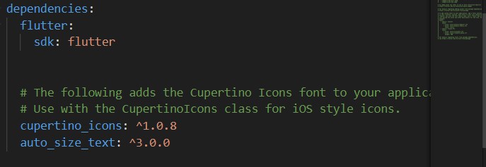
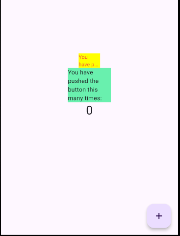

# Manajemen Plugin

Banyak framework pemrograman dan software memiliki konsep plugin. Terkadang menggunakan nama lain, seperti library pihak ketiga, ekstensi, atau add-on, tetapi itu adalah hal yang sama – pengiriman kode modular mandiri yang dapat "plugged in" ke kode aplikasi yang ada untuk menyediakan fungsionalitas ekstra.

## Praktikum

1. **Menambahkan Plugin**

   Tambahkan plugin auto_size_text menggunakan perintah berikut di terminal

   ```bash
   flutter pub add auto_size_text
   ```

   

2. **Buat file red_text_widget.dart**

   Buat file baru bernama red_text_widget.dart di dalam folder lib lalu isi kode seperti berikut.

   ```dart
   import 'package:flutter/material.dart';

   class RedTextWidget extends StatelessWidget {
       const RedTextWidget({Key? key}) : super(key: key);

       @override
       Widget build(BuildContext context) {
           return Container();
       }
   }
   ```

3. **Tambah Widget AutoSizeText**

   Masih di file red_text_widget.dart, untuk menggunakan plugin auto_size_text, ubahlah kode return Container() menjadi seperti berikut.

   ```dart
   return AutoSizeText(
       text,
       style: const TextStyle(color: Colors.red, fontSize: 14),
       maxLines: 2,
       overflow: TextOverflow.ellipsis,
   );
   ```

4. **Buat Variabel text dan parameter di constructor**

   Tambahkan variabel text dan parameter di constructor seperti berikut.

   ```dart
   final String text;

   const RedTextWidget({Key? key, required this.text}) : super(key: key);
   ```

5. **Tambahkan widget di main.dart**

   Buka file main.dart lalu tambahkan di dalam children: pada class \_MyHomePageState

   ```dart
       Container(
   color: Colors.yellowAccent,
   width: 50,
   child: const RedTextWidget(
               text: 'You have pushed the button this many times:',
           ),
   ),
   Container(
       color: Colors.greenAccent,
       width: 100,
       child: const Text(
           'You have pushed the button this many times:',
           ),
   ),
   ```

   

## Tugas

1. **Jelaskan maksud dari langkah 2 pada praktikum tersebut!**

   Perintah flutter pub add auto_size_text digunakan untuk menambahkan package bernama auto_size_text ke dalam proyek Flutter. Package ini memungkinkan teks di dalam widget untuk secara otomatis menyesuaikan ukurannya agar sesuai dengan ruang yang tersedia, yang sangat berguna untuk mendukung responsivitas UI.

2. **Jelaskan maksud dari langkah 5 pada praktikum tersebut!**

   - **`final String text;`**: Ini mendefinisikan sebuah properti text bertipe String yang bersifat final, artinya nilainya hanya dapat diinisialisasi sekali (biasanya melalui konstruktor) dan tidak bisa diubah setelahnya.

   - **`{Key? key, required this.text}`**: Ini adalah parameter-parameter yang diterima oleh konstruktor RedTextWidget. Parameter key bersifat opsional (nullable, Key?), sedangkan parameter text bersifat required (wajib diisi ketika membuat instance widget ini). Kata kunci required memastikan bahwa pengguna widget harus memberikan nilai untuk text.

3. **Pada langkah 6 terdapat dua widget yang ditambahkan, jelaskan fungsi dan perbedaannya!**

   - **`Container 1`** teks terpotong dan muncul tanda elipsis (...) karna teksnya tidak muat.

   - **`Container 2`** Pada lebar 100, teks akan ditampilkan secara penuh

4. **Jelaskan maksud dari tiap parameter yang ada di dalam plugin `auto_size_text`**

   Plugin auto_size_text di Flutter memiliki beberapa parameter yang memungkinkan Anda untuk menyesuaikan perilaku dan tampilan teks agar dapat secara otomatis menyesuaikan ukuran teks berdasarkan ruang yang tersedia.

   - **`text`** (String): Ini adalah teks yang akan ditampilkan oleh widget AutoSizeText.
   - **`style`** (TextStyle?): Ini digunakan untuk mengatur gaya teks, seperti warna, ukuran font, berat huruf (bold), dan lain-lain.
   - **`maxLines`** (int?): Ini menentukan berapa baris maksimal teks yang dapat ditampilkan. Jika teks melebihi jumlah baris yang ditentukan, teks akan diatur ulang agar sesuai dengan ruang, dan jika tetap tidak cukup, elipsis (...) akan ditampilkan (jika diaktifkan).
   - **`minFontSize`** (double): Menentukan ukuran font minimum yang akan digunakan. Teks akan menyesuaikan ukurannya, tetapi tidak akan lebih kecil dari nilai ini.
   - **`maxFontSize`** (double): Menentukan ukuran font maksimum yang akan digunakan. Teks akan diperbesar hingga ukuran ini, tetapi tidak akan lebih besar dari nilai yang ditentukan.
   - **`stepGranularity`** (double): Menentukan langkah penyesuaian ukuran font saat AutoSizeText mencoba menyesuaikan teks dengan ruang yang tersedia. Semakin kecil nilainya, semakin halus perubahannya.
   - **`presetFontSizes`** (List<double>?): Jika diberikan, ini adalah daftar ukuran font yang akan dicoba oleh AutoSizeText. Daripada mengurangi ukuran font secara bertahap, plugin akan memilih ukuran font dari daftar ini untuk menyesuaikan teks.
   - **`overflow`** (TextOverflow): Menentukan bagaimana teks yang tidak muat dalam ruang yang diberikan ditangani. Misalnya, jika teks terlalu panjang untuk ditampilkan sepenuhnya, apakah teks akan dipotong, diberi elipsis (...), atau digulung ke baris berikutnya.
   - **`softWrap`** (bool?): Menentukan apakah teks boleh dibungkus ke baris berikutnya saat tidak cukup ruang di baris yang ada.
   - **`wrapWords`** (bool): Menentukan apakah kata-kata dalam teks boleh dipotong atau diatur ulang untuk menyesuaikan ruang yang ada.
   - **`textAlign`** (TextAlign?): Menentukan bagaimana teks akan diratakan di dalam ruang yang tersedia (misalnya rata kiri, rata kanan, rata tengah, atau justified).
   - **`overflowReplacement`** (Widget?): Jika teks terlalu besar untuk ditampilkan dan melampaui batas yang ditentukan, widget ini akan menggantikan teks yang meluap. Ini berguna jika Anda ingin menampilkan sesuatu selain teks elipsis saat terjadi overflow.
   - **`textDirection`** (TextDirection?): Menentukan arah penulisan teks, apakah dari kiri ke kanan (ltr) atau dari kanan ke kiri (rtl).
   - **`locale`** (Locale?): Menentukan locale (bahasa) untuk teks, yang berguna untuk mendukung tata letak bahasa tertentu.
   - **`maxFontSizeBehavior`** (AutoSizeTextBehavior): Menentukan apakah widget akan mencoba menyetel ukuran font ke nilai terbesar dalam rentang minFontSize dan maxFontSize yang sesuai dengan konten.

   AutoSizeText memberi Anda fleksibilitas untuk menyesuaikan ukuran teks berdasarkan ruang yang tersedia dengan berbagai parameter seperti batas ukuran font (minFontSize, maxFontSize), perilaku overflow (overflow), dan bagaimana teks harus dirender (wrapWords, softWrap, textAlign). Hal ini membuatnya sangat berguna dalam situasi di mana UI harus responsif dan teks harus selalu terlihat jelas tanpa mengorbankan keterbacaan.
