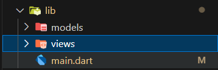
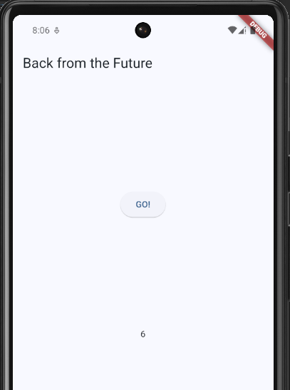
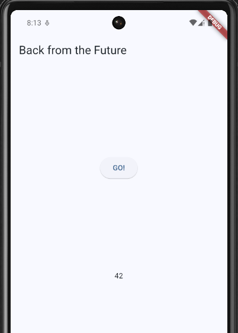

# Pemrograman Asynchronous

Pemrograman asynchronous (async) dimanfaatkan untuk aplikasi menyelesaikan tugas-tugas yang membutuhkan waktu (user harus menunggu hasilnya). Contohnya seperti mengunduh gambar dari web, menulis data ke web server, mengerjakan tugas paralel lainnya, hingga menangani inputan dari user. Dengan pemrograman async ini akan meningkatkan kualitas UX dan perangkat lunak kita.

## Praktikum 1

1. Buat Project Baru dan tambahkan dependensi http

   ```bash
   flutter pub add http
   ```

2. Cek file `pubspec.yaml`

   ```yaml
   dependencies:
     flutter:
       sdk: flutter
     cupertino_icons: ^1.0.8
     http: ^1.2.2
   ```

3. Buka file `main.dart`

   ```dart
   import 'package:flutter/material.dart';

   void main() {
       runApp(const MyApp());
   }

   class MyApp extends StatelessWidget {
       const MyApp({super.key});

       @override
       Widget build(BuildContext context) {
           return MaterialApp(
           title: 'Flutter Demo',
           theme: ThemeData(
               colorScheme: ColorScheme.fromSeed(seedColor: Colors.blue),
               useMaterial3: true,
               visualDensity: VisualDensity.adaptivePlatformDensity,
           ),
           home: const FuturePage(),
           );
       }
   }

   class FuturePage extends StatefulWidget {
       const FuturePage({super.key});

       @override
       State<FuturePage> createState() => _FuturePageState();
   }

   class _FuturePageState extends State<FuturePage> {
       String result = '';

       @override
       Widget build(BuildContext context) {
           return Scaffold(
               appBar: AppBar(
                   title: const Text('Back from the Future'),
               ),
               body: Center(
                   child: Column(
                       children: [
                           const Spacer(),
                           ElevatedButton(onPressed: () {}, child: const Text('GO!')),
                           const Spacer(),
                           Text(result),
                           const Spacer(),
                           const CircularProgressIndicator(),
                           const Spacer(),
                       ],
                   ),
               ),
           );
       }
   }
   ```
    - Soal 1 
    > ```dart
    >   title: 'By'
    > ```


4. Tambah method `getData()`

   ```dart
   Future<Response> getData() async {
       const authority = 'www.googleapis.com';
       const path = '/books/v1/volumes/junbDwAAQBAJ';
       Uri url = Uri.https(authority, path);
       return http.get(url);
   }
   ```
    - Soal 2
    > ```dart
    > const path = '/books/v1/volumes/jWTvDwAAQBAJ';
    > ```
5. Tambah kode di ElevatedButton

   ```dart
   onPressed: () {
       setState(() {
           getData().then((value) {
               result = value.body.toString().substring(0, 450);
               setState(() {});
           }).catchError((_) {
               result = 'An error occurred';
               setState(() {});
           });
       });
   }
   ```

6. Hasil

   

## Praktikum 2

1. Buka file `main.dart`

   Tambahkan tiga method berisi kode seperti berikut di dalam class \_FuturePageState.

   ```dart
   Future<int> returnOneAsync() async {
       await Future.delayed(const Duration(seconds: 3));
       return 1;
   }

   Future<int> returnTwoAsync() async {
       await Future.delayed(const Duration(seconds: 3));
       return 2;
   }

   Future<int> returnThreeAsync() async {
       await Future.delayed(const Duration(seconds: 3));
       return 3;
   }
   ```

2. Tambah method `count()`

   ```dart
   Future count() async {
       int total = 0;
       total = await returnOneAsync();
       total += await returnTwoAsync();
       total += await returnThreeAsync();
       setState(() {
       result = total.toString();
       });
   }
   ```

3. Panggil `count()`

   ```dart
   ElevatedButton(
       onPressed: () {
           count();
       },
       child: const Text('GO!'),
   ),
   ```

4. Hasil

   

## Praktikum 3

1. Buka `main.dart`

   Pastikan telah impor package async berikut.

   ```dart
   import 'package:async/async.dart';
   ```

2. Tambahkan variabel dan method

   ```dart
   late Completer completer;

   Future getNumber() {
       completer = Completer<int>();
       calculate();
       return completer.future;
   }

   Future calculate() async {
       await Future.delayed(const Duration(seconds : 5));
       completer.complete(42);
   }
   ```

3. Ganti isi kode `onPressed()`

   ```dart
   getNumber().then((value) {
       setState(() {
           result = value.toString();
       });
   });
   ```

4. Hasil

   

5. Ganti method `calculate()`

   ```dart
   Future calculate() async {
       try {
           await Future.delayed(const Duration(seconds: 5));
           completer.complete(42);
       } catch (_) {
           completer.completeError({});
       }
   }
   ```

6. Pindah ke `onPressed()`

   ```dart
   getNumber().then((value) {
       setState(() {
           result = value.toString();
       });
   }).catchError((e) {
       result = 'An error occurred';
   });
   ```

7.
