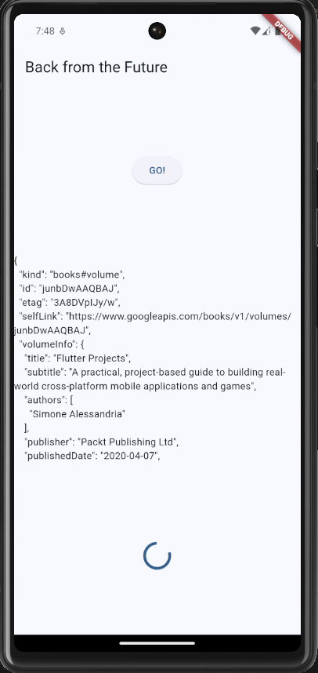

# Dasar State Managements

State Managements mengacu pada manajemen status dari satu atau lebih kontrol antarmuka pengguna seperti bidang teks, tombol kirim, tombol radio, dll. dalam antarmuka pengguna grafis. Dalam teknik pemrograman antarmuka pengguna ini, status satu kontrol UI bergantung pada status kontrol UI lainnya.

## Praktikum 1

1. Menerapkan struktur folder Model-View

   

2. Membuat model task.dart

   ```dart
   class Task {
       final String description;
       final bool complete;

       const Task({
           this.complete = false,
           this.description = '',
       });
   }
   ```

3. Buat file plan.dart

   ```dart
   import 'package:state/models/task.dart';

    class Plan {
        final String name;
        final List<Task> tasks;

        const Plan({this.name = '', this.tasks = const []});
    }
   ```

4. Buat file data_layer.dart

   ```dart
   export 'plan.dart';
   export 'task.dart';
   ```

5. Ubah isi kode main.dart sebagai berikut.

   ```dart
   import 'package:flutter/material.dart';
   import './views/plan_screen.dart';

   void main() => runApp(MasterPlanApp());

   class MasterPlanApp extends StatelessWidget {
   const MasterPlanApp({super.key});

       @override
       Widget build(BuildContext context) {
           return MaterialApp(
           theme: ThemeData(primarySwatch: Colors.purple),
           home: PlanScreen(),
           );
       }
   }
   ```

6. buat plan_screen.dart

   ```dart
   import '../models/data_layer.dart';
   import 'package:flutter/material.dart';

   class PlanScreen extends StatefulWidget {
   const PlanScreen({super.key});

   @override
   State createState() => _PlanScreenState();
   }

   class _PlanScreenState extends State<PlanScreen> {
   Plan plan = const Plan();

       @override
       Widget build(BuildContext context) {
       return Scaffold(
           appBar: AppBar(title: const Text('Master Plan Al Byan')),
           body: _buildList(),
           floatingActionButton: _buildAddTaskButton(),
       );
       }
   }
   ```

7. buat method \_buildAddTaskButton()
   ```dart
   Widget _buildAddTaskButton() {
       return FloatingActionButton(
       child: const Icon(Icons.add),
       onPressed: () {
           setState(() {
           plan = Plan(
           name: plan.name,
           tasks: List<Task>.from(plan.tasks)
           ..add(const Task()),
           );
           });
       },
       );
   }
   ```
8. buat widget \_buildList()

   ```dart
   Widget _buildList() {
       return ListView.builder(
           itemCount: plan.tasks.length,
           itemBuilder: (context, index) =>
           _buildTaskTile(plan.tasks[index], index),
       );
   }
   ```

9. buat widget \_buildTaskTile

   ```dart
   Widget _buildTaskTile(Task task, int index) {
   return ListTile(
     leading: Checkbox(
         value: task.complete,
         onChanged: (selected) {
           setState(() {
             plan = Plan(
               name: plan.name,
               tasks: List<Task>.from(plan.tasks)
                 ..[index] = Task(
                   description: task.description,
                   complete: selected ?? false,
                 ),
             );
           });
         }),
     title: TextFormField(
       initialValue: task.description,
       onChanged: (text) {
         setState(() {
           plan = Plan(
             name: plan.name,
             tasks: List<Task>.from(plan.tasks)
               ..[index] = Task(
                 description: text,
                 complete: task.complete,
               ),
           );
         });
       },
     ),
   );
   }
   ```

10. Tambah Scroll Controller

    ```dart
    late ScrollController scrollController;
    ```

11. Tambah Scroll Listener

    ```dart
    @override
    void initState() {
        super.initState();
        scrollController = ScrollController()
            ..addListener(() {
            FocusScope.of(context).requestFocus(FocusNode());
        });
    }
    ```

12. Tambah controller dan keyboard behavior

    ```dart
    return ListView.builder(
    controller: scrollController,
    keyboardDismissBehavior: Theme.of(context).platform ==
    TargetPlatform.iOS
            ? ScrollViewKeyboardDismissBehavior.onDrag
            : ScrollViewKeyboardDismissBehavior.manual,
    ```

13. Terakhir, tambah method dispose()
    ```dart
    @override
    void dispose() {
        scrollController.dispose();
        super.dispose();
    }
    ```
14. Hasil
    

## Tugas Praktikum 1

1. Jelaskan maksud dari langkah 4 pada praktikum tersebut! Mengapa dilakukan demikian?

   > Fungsi dari export ini adalah untuk membuat file yang menggabungkan beberapa file lainnya, sehingga dapat mengimpor semuanya sekaligus dari satu file. Ini berguna untuk organisasi kode dan kemudahan pengelolaan.

2. Mengapa perlu variabel plan di langkah 6 pada praktikum tersebut? Mengapa dibuat konstanta ?

   > Variabel plan digunakan untuk menyimpan dan mengelola data rencana (plan) yang berisi daftar tugas (tasks). const digunakan untuk menunjukkan bahwa objek Plan yang diciptakan adalah immutable (tidak bisa diubah) dan nilainya sudah diketahui pada waktu kompilasi.

3. Lakukan capture hasil dari Langkah 9 berupa GIF, kemudian jelaskan apa yang telah Anda buat!

   > 
   > Fungsi \_buildTaskTile bertanggung jawab untuk menampilkan setiap item tugas (Task) dalam bentuk widget ListTile pada layar.

4. Apa kegunaan method pada Langkah 11 dan 13 dalam lifecyle state ?
   > - initState() adalah metode yang dipanggil sekali, ketika widget pertama kali dibuat. Metode ini biasanya digunakan untuk menginisialisasi data atau mempersiapkan objek yang diperlukan selama widget aktif.
   > - dispose() adalah metode yang dipanggil ketika widget dihapus dari widget tree secara permanen, atau lebih tepatnya ketika instance dari State akan dihancurkan.

## Praktikum 2

1. Buat file plan_provider.dart

   ```dart
   import 'package:flutter/material.dart';
   import '../models/data_layer.dart';

   class PlanProvider extends InheritedNotifier<ValueNotifier<Plan>> {
       const PlanProvider({super.key, required Widget child, required
       ValueNotifier<Plan> notifier})
       : super(child: child, notifier: notifier);

       static ValueNotifier<Plan> of(BuildContext context) {
       return context.
           dependOnInheritedWidgetOfExactType<PlanProvider>()!.notifier!;
       }
   }
   ```

2. Edit main.dart

   ```dart
   return MaterialApp(
       theme: ThemeData(primarySwatch: Colors.purple),
       home: PlanProvider(
           notifier: ValueNotifier<Plan>(const Plan()),
           child: const PlanScreen(),
       ),
   );
   ```

3. Tambah method pada model plan.dart

   ```dart
   int get completedCount => tasks
   .where((task) => task.complete)
   .length;

   String get completenessMessage =>
   '$completedCount out of ${tasks.length} tasks';
   ```

4. Pindah ke PlanScreen

   ```dart
   final planNotifier = PlanProvider.of(context);
   ```

5. Edit method \_buildAddTaskButton

   ```dart
   Widget _buildAddTaskButton(BuildContext context) {
       ValueNotifier<Plan> planNotifier = PlanProvider.of(context);
       return FloatingActionButton(
           child: const Icon(Icons.add),
               onPressed: () {
               Plan currentPlan = planNotifier.value;
               planNotifier.value = Plan(
                   name: currentPlan.name,
                   tasks: List<Task>.from(currentPlan.tasks)..add(const Task()),
               );
           },
       );
   }
   ```

6. Edit method \_buildTaskTile

   ```dart
   Widget _buildTaskTile(Task task, int index, BuildContext context) {
   ValueNotifier<Plan> planNotifier = PlanProvider.of(context);
       return ListTile(
           leading: Checkbox(
           value: task.complete,
           onChanged: (selected) {
               Plan currentPlan = planNotifier.value;
               planNotifier.value = Plan(
               name: currentPlan.name,
               tasks: List<Task>.from(currentPlan.tasks)
                   ..[index] = Task(
                   description: task.description,
                   complete: selected ?? false,
                   ),
               );
           }),
           title: TextFormField(
           initialValue: task.description,
               onChanged: (text) {
                   Plan currentPlan = planNotifier.value;
                   planNotifier.value = Plan(
                   name: currentPlan.name,
                   tasks: List<Task>.from(currentPlan.tasks)
                       ..[index] = Task(
                       description: text,
                       complete: task.complete,
                       ),
                   );
               },
           ),
       );
   }
   ```

7. Edit \_buildList

   ```dart
   Widget _buildList(Plan plan) {
       return ListView.builder(
           controller: scrollController,
           itemCount: plan.tasks.length,
           itemBuilder: (context, index) =>
               _buildTaskTile(plan.tasks[index], index, context),
       );
   }
   ```

8. Tambah widget SafeArea
   ```dart
   @override
   Widget build(BuildContext context) {
   return Scaffold(
           appBar: AppBar(title: const Text('Master Plan')),
           body: ValueListenableBuilder<Plan>(
           valueListenable: PlanProvider.of(context),
           builder: (context, plan, child) {
               return Column(
               children: [
                   Expanded(child: _buildList(plan)),
                   SafeArea(child: Text(plan.completenessMessage))
               ],
               );
           },
           ),
           floatingActionButton: _buildAddTaskButton(context),
       );
   }
   ```
9. Hasil
   

## Tugas Praktikum 2

1. Jelaskan mana yang dimaksud InheritedWidget pada langkah 1 tersebut! Mengapa yang digunakan InheritedNotifier?
   > **`PlanProvider`** merupakan turunan dari _InheritedNotifier_. _InheritedNotifier_ dipilih daripada _InheritedWidget_ karena kebutuhan untuk merespon perubahan data secara dinamis. Dengan menggunakan _InheritedNotifier_, aplikasi mendapatkan keuntungan dari Listenable yang memberi tahu widget untuk rebuild hanya ketika nilai di ValueNotifier berubah. Ini lebih efisien daripada menggunakan InheritedWidget murni karena InheritedNotifier tidak akan memaksa semua widget di bawahnya untuk rebuild secara keseluruhan, melainkan hanya yang mendengarkan perubahan data.

2. Jelaskan maksud dari method di langkah 3 pada praktikum tersebut! Mengapa dilakukan demikian?
    > - completedCount menghitung jumlah tugas yang sudah selesai (complete).
    > - completenessMessage membuat pesan teks yang menunjukkan berapa banyak tugas yang sudah selesai dibandingkan dengan total tugas.

3. Lakukan capture hasil dari Langkah 9 berupa GIF, kemudian jelaskan apa yang telah Anda buat!
    > 
    > Pada Praktikum ini adalah manajemen tugas sederhana menggunakan Flutter dengan pola State Management berbasis InheritedNotifier. Setiap perubahan pada data (misal: menambah atau mengubah tugas) akan otomatis memperbarui UI tanpa perlu kode tambahan untuk state management manual.

## Praktikum 3
