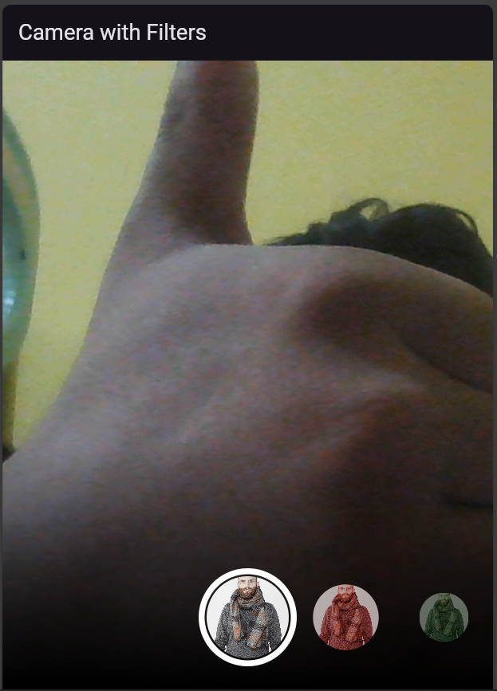

# Tugas Kamera

1. Gabungkan hasil praktikum 1 dengan hasil praktikum 2 sehingga setelah melakukan pengambilan foto, dapat dibuat filter carouselnya!

   > 

2. Jelaskan maksud void async pada praktikum 1?

   > **`Future<void>`** menunjukkan bahwa fungsi main() adalah fungsi asinkron yang tidak mengembalikan nilai, dan kata kunci async digunakan untuk menandai bahwa fungsi tersebut bisa melakukan operasi yang memerlukan waktu (seperti mengambil kamera) tanpa memblokir eksekusi kode lainnya.

3. Jelaskan fungsi dari anotasi @immutable dan @override ?

   > - Anotasi **_`@immutable`_** digunakan untuk menandai bahwa kelas tersebut bersifat immutable (tidak dapat diubah setelah objek dibuat). Ini artinya, setelah objek dari kelas tersebut dibuat, nilai dari semua propertinya tidak bisa diubah.

   > - Anotasi **_`@override`_** digunakan untuk menunjukkan bahwa suatu metode atau getter/setter di kelas anak menimpa (override) metode atau getter/setter yang ada di kelas induk. Ini memberi tahu kompilator dan pengembang lain bahwa metode tersebut bertujuan untuk menggantikan implementasi dari kelas induk.
