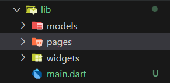
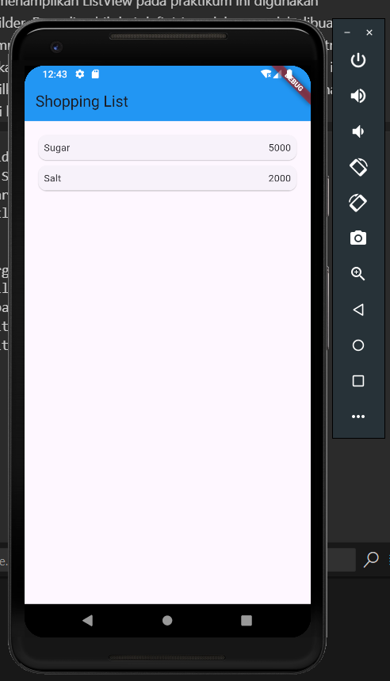
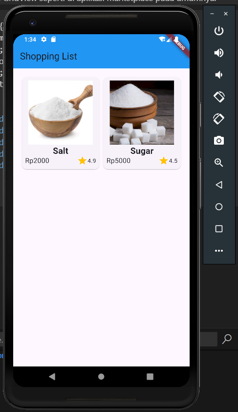
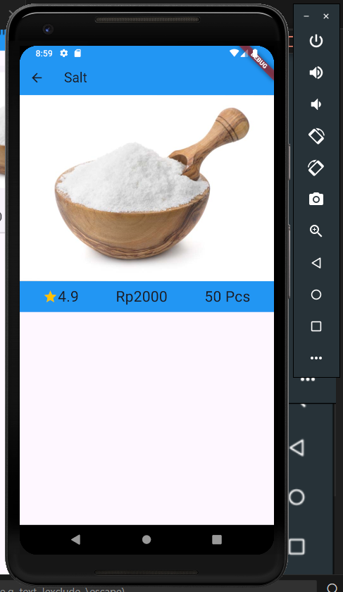
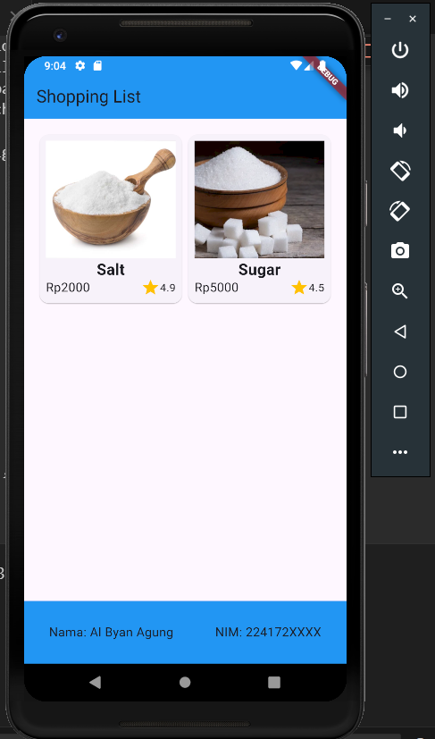

# Layout dan Navigase

## Membangun Navigasi di Flutter

1. Siapkan project baru
   > Sebelum melanjutkan praktikum, buatlah sebuah project baru Flutter dengan nama belanja dan susunan folder seperti pada gambar berikut. Penyusunan ini dimaksudkan untuk mengorganisasi kode dan widget yang lebih mudah.



2. Mendefinisikan Route
   > Buatlah dua buah file dart dengan nama home_page.dart dan item_page.dart pada folder pages. Untuk masing-masing file, deklarasikan class HomePage pada file home_page.dart dan ItemPage pada item_page.dart. Turunkan class dari StatelessWidget. Gambaran potongan kode dapat anda lihat sebagai berikut.

```dart
//home_page.dart
class HomePage extends StatelessWidget {
  @override
  Widget build(BuildContext context) {
    throw UnimplementedError();
  }
}
//item_page.dart
class ItemPage extends StatelessWidget {
  @override
  Widget build(BuildContext context) {
    throw UnimplementedError();
  }
}
```

3. Lengkapi Kode di main.dart
   > Pada langkah ini anda akan mendefinisikan Route untuk kedua halaman tersebut. Definisi penamaan route harus bersifat unique. Halaman HomePage didefinisikan sebagai /. Dan halaman ItemPage didefinisikan sebagai /item. Untuk mendefinisikan halaman awal, anda dapat menggunakan named argument initialRoute. Gambaran tahapan ini, dapat anda lihat pada potongan kode berikut.

```dart
runApp(MaterialApp(
    initialRoute: '/',
    routes: {
      '/': (context) => HomePage(),
      '/item': (context) => ItemPage()
    },
  ))
```

4.  Membuat data model
    > buatlah sebuah file dengan nama item.dart dan letakkan pada folder models. Pada file ini didefinisikan pemodelan data yang dibutuhkan. Ilustrasi kode yang dibutuhkan, dapat anda lihat pada potongan kode berikut.

```dart
class Item {
  String name;
  int price;

  Item({required this.name, required this.price});
}
```

5. Lengkapi kode di class HomePage
   > Pada halaman HomePage terdapat ListView widget. Sumber data ListView diambil dari model List dari object Item. Gambaran kode yang dibutuhkan untuk melakukan definisi model dapat anda lihat sebagai berikut.

```dart
final List<Item> items = [
    Item(name: "Sugar", price: 5000),
    Item(name: "Salt", price: 2000),
  ];
```

6. Membuat ListView dan itemBuilder
   > Untuk menampilkan ListView pada praktikum ini digunakan itemBuilder. Data diambil dari definisi model yang telah dibuat sebelumnya. Untuk menunjukkan batas data satu dan berikutnya digunakan widget Card. Kode yang telah umum pada bagian ini tidak ditampilkan. Gambaran kode yang dibutuhkan dapat anda lihat sebagai berikut.

```dart
Widget build(BuildContext context) {
    return Scaffold(
      appBar: AppBar(
        title: const Text("Shopping List"),
      ),
      body: Container(
        margin: EdgeInsets.all(8),
        child: ListView.builder(
          padding: EdgeInsets.all(8),
          itemCount: items.length,
          itemBuilder: (context, index) {
            final item = items[index];
            return Card(
              child: Container(
                margin: EdgeInsets.all(8),
                child: Row(
                  children: [
                    Expanded(child: Text(item.name)),
                    Expanded(
                      child: Text(
                        item.price.toString(),
                        textAlign: TextAlign.end,
                      ),
                    )
                  ],
                ),
              ),
            );
          },
        ),
      ),
    );
  }
```

Hasilnya:


7. Menambahkan aksi pada ListView
   > Item pada ListView saat ini ketika ditekan masih belum memberikan aksi tertentu. Untuk menambahkan aksi pada ListView dapat digunakan widget InkWell atau GestureDetector. Perbedaan utamanya InkWell merupakan material widget yang memberikan efek ketika ditekan. Sedangkan GestureDetector bersifat umum dan bisa juga digunakan untuk gesture lain selain sentuhan. Pada praktikum ini akan digunakan widget InkWell.

```dart
return InkWell(
        onTap: () {
            Navigator.pushNamed(context, '/item');
        }
    )
```

## Tugas 2

> 1.  Untuk melakukan pengiriman data ke halaman berikutnya, cukup menambahkan informasi arguments pada penggunaan Navigator. Perbarui kode pada bagian Navigator menjadi seperti berikut.

```dart
Navigator.pushNamed(context, '/item', arguments: item);
```

> 2.  Pembacaan nilai yang dikirimkan pada halaman sebelumnya dapat dilakukan menggunakan ModalRoute. Tambahkan kode berikut pada blok fungsi build dalam halaman ItemPage. Setelah nilai didapatkan, anda dapat menggunakannya seperti penggunaan variabel pada umumnya.

```dart
@override
  Widget build(BuildContext context) {
    final itemArgs = ModalRoute.of(context)!.settings.arguments as Item;

    return Scaffold(
      appBar: AppBar(
        title: Text(itemArgs.name),
      ),
      body: Center(
        child: Text(itemArgs.name),
      ),
    );
  }
```

> 3.  Pada hasil akhir dari aplikasi belanja yang telah anda selesaikan, tambahkan atribut foto produk, stok, dan rating. Ubahlah tampilan menjadi GridView seperti di aplikasi marketplace pada umumnya.

```dart
class Item {
  String name;
  int price;
  String photo;
  int stock;
  double rating;

  Item({
    required this.name,
    required this.price,
    required this.photo,
    required this.stock,
    required this.rating,
  });
}
```

Hasilnya:


> 4.  Silakan implementasikan Hero widget pada aplikasi belanja Anda dengan mempelajari dari sumber ini:

```dart
Hero(
  tag: item.name,
  child: Image.asset(
    tem.photo,
    fit: BoxFit.cover,
  ),
)
```

Hasilnya:


> 5.  Sesuaikan dan modifikasi tampilan sehingga menjadi aplikasi yang menarik. Selain itu, pecah widget menjadi kode yang lebih kecil. Tambahkan Nama dan NIM di footer aplikasi belanja Anda.

```dart
bottomNavigationBar: const BottomAppBar(
        color: Colors.blue,
        child: Padding(
          padding: const EdgeInsets.all(16.0),
          child: Row(
            mainAxisAlignment: MainAxisAlignment.spaceBetween,
            children: [
              Text(
                "Nama: Al Byan Agung", // Teks nama
                style: const TextStyle(
                  fontSize: 16,
                ),
              ),
              Text(
                "NIM: 224172XXXX",
                style: const TextStyle(
                  fontSize: 16,
                ),
              ),
            ],
          ),
        ),
      ),
```

Hasilnya:


> 6.  Cobalah modifikasi menggunakan plugin go_router, lalu dokumentasikan dan push ke repository Anda berupa screenshot setiap hasil pekerjaan beserta penjelasannya di file README.md.

```dart
//main.dart
void main() {
  runApp(MaterialApp.router(
    routerConfig: _router,
  ));
}

final GoRouter _router = GoRouter(
  routes: [
    GoRoute(
      path: '/',
      builder: (context, state) => HomePage(),
    ),
    GoRoute(
      path: '/item',
      builder: (context, state) => const ItemPage(),
    ),
  ],
);

//home_page.dart
return InkWell(
          onTap: () {
            context.go('/item', extra: item);
          },
        )

//item_page.dart
final itemArgs = GoRouterState.of(context).extra as Item;
```
